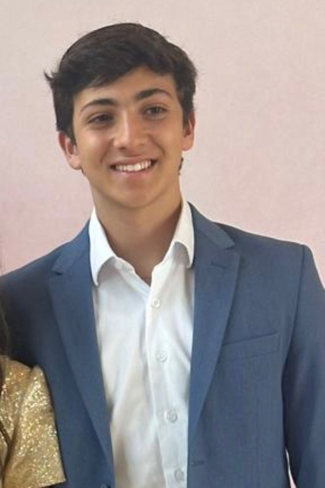

# Inteli - Instituto de Tecnologia e Liderança 

 

# Nome do projeto

## Nome do grupo

## 👨‍🎓 Integrantes:

<table align="center">
  <tr>
    <td align="center">
      <a href="https://www.linkedin.com/in/victorbarq/">
         
        <b>Daniel Hamoui</b>
      </a>
    </td>
    <td align="center">
      <a href="https://www.linkedin.com/in/eduardo-izawa-maciel-64b2a0383/">
         
        <b>Eduardo Hirohito Izawa Maciel</b>
      </a>
    </td>
    <td align="center">
      <a href="https://www.linkedin.com/in/joão-luvisotto-alckmin-2785a83a9/">
         
        <b>João Luvisotto Alckmin</b>
      </a>
    </td>
    <td align="center">
      <a href="https://www.linkedin.com/in/julia-khristina-13bb602a3/">
         
        <b>Júlia Khristina de Oliveira Silva Souza</b>
      </a>
    </td>
  </tr>
  <tr>
    <td align="center">
      <a href="https://www.linkedin.com/in/lucas-crespo-margoni-72358a3a9">
         
        <b>Lucas Crespo Margoni</b>
      </a>
    </td>
    <td align="center">
      <a href="https://www.linkedin.com/in/miguelvvinicius/">
         
        <b>Miguel Vinícius da Silva</b>
      </a>
    </td>
    <td align="center">
      <a href="https://www.linkedin.com/in/victorbarq/">
         
        <b>Nicoly Mendes Adesanmi</b>
      </a>
    </td>
    <td align="center">
      <a href="https://www.linkedin.com/in/vitor-tadashi-m-332a373ab/">
         
        <b>Vitor Tadashi Martins Goia</b>
      </a>
    </td>
  </tr>
</table>

## 👩‍🏫 Professores:
### Orientador(a) 
- <a href="https://www.linkedin.com/in/profclaudioandre/">Claudio Fernando André</a>
### Instrutores
- <a href="linkedin.com/in/zotovici">Andrea Zotovici</a>
- <a href="https://www.linkedin.com/in/bruna-mayer/">Bruna Mayer Costa</a>
- <a href="https://www.linkedin.com/in/henrique-mohallem-paiva-6854b460/">Henrique Mohallem Paiva<a> 
- <a href="https://www.linkedin.com/in/natalia-k-37a62052/">Natalia Kloeckner</a> 
- <a href="https://www.linkedin.com/in/marcelo-gon%C3%A7alves-phd/">Marcelo Gonçalves</a> 

## 📜 Descrição

*Descreva seu projeto (até 600 palavras)*

*Inclua o link para o jogo aqui*

## 📁 Estrutura de pastas

Dentre os arquivos e pastas presentes na raiz do projeto, definem-se:

- <b>assets</b>: aqui estão os arquivos relacionados a elementos não-estruturados deste repositório, como imagens.

- <b>document</b>: aqui estão todos os documentos do projeto, como o Game Development Document (GDD) bem como documentos complementares, na pasta "other".

- <b>src</b>: Todo o código fonte criado para o desenvolvimento do projeto do jogo.

- <b>README.md</b>: arquivo que serve como guia e explicação geral sobre o projeto e o jogo (o mesmo que você está lendo agora).

## 🔧 Como executar o código

*Acrescentar as informações necessárias sobre pré-requisitos (IDEs, serviços etc.) e instalação básica do projeto, descrevendo eventuais versões utilizadas. Colocar um passo a passo de como o leitor pode baixar o código e executar o jogo a partir de sua máquina ou seu repositório.*

## 🗃 Histórico de lançamentos

* 0.5.0 - XX/XX/2024
    * 
* 0.4.0 - XX/XX/2024
    * 
* 0.3.0 - XX/XX/2024
    * 
* 0.2.0 - XX/XX/2024
    * 
* 0.1.0 - XX/XX/2024
    *

## 📋 Licença/License

<a property="dct:title" rel="cc:attributionURL" href="https://github.com/Intelihub/Template_M1">MODELO GIT INTELI</a> by <a rel="cc:attributionURL dct:creator" property="cc:attributionName" href="https://github.com/Intelihub/Template_M1">Inteli, Daniel Hamoui, Eduardo Hirohito Izawa Maciel, João Luvisotto Alckmin, Júlia Khristina de Oliveira Silva Souza, Lucas Crespo Margoni, Miguel Vinícius da Silva, Nicoly Mendes Adesanmi, Vitor Tadashi Martins Goia</a> is licensed under <a href="http://creativecommons.org/licenses/by/4.0/?ref=chooser-v1" target="_blank" rel="license noopener noreferrer" style="display:inline-block;">Attribution 4.0 International</a>.

