# GDD - Game Design Document - Módulo 1 - Inteli

**_Os trechos em itálico servem apenas como guia para o preenchimento da seção. Por esse motivo, não devem fazer parte da documentação final_**

## Nome do Grupo


- <a href="https://www.linkedin.com/in/victorbarq/">Daniel Hamoui</a>
- <a href="https://www.linkedin.com/in/eduardo-izawa-maciel-64b2a0383/">Eduardo Hirohito Izawa Maciel</a>
- <a href="www.linkedin.com/in/joão-luvisotto-alckmin-2785a83a9/">João Luvisotto Alckmin</a> 
- <a href="https://www.linkedin.com/in/victorbarq/">Julia Khristina de Oliveira Silva Souza</a> 
- <a href="www.linkedin.com/in/lucas-crespo-margoni-72358a3a9">Lucas Crespo Margoni</a>
- <a href="https://www.linkedin.com/in/miguelvvinicius/">Miguel Vinícius da Silva</a> 
- <a href="https://www.linkedin.com/in/victorbarq/">Nicoly Mendes Adesanmi</a>
- <a href="www.linkedin.com/in/vitor-tadashi-m-332a373ab/">Vitor Tadashi Martins Goia</a>


## Sumário

[1. Introdução](#c1)

[2. Visão Geral do Jogo](#c2)

[3. Game Design](#c3)

[4. Desenvolvimento do jogo](#c4)

[5. Casos de Teste](#c5)

[6. Conclusões e trabalhos futuros](#c6)

[7. Referências](#c7)

[Anexos](#c8)

<br>


# <a name="c1"></a>1. Introdução

## 1.1. Plano Estratégico do Projeto

### 1.1.1. Contexto da indústria

O projeto de desenvolvimento de jogos educacionais acessíveis integra-se à indústria de tecnologia assistiva, um setor em expansão que busca mitigar barreiras de aprendizagem por meio da inovação digital. Nesse cenário, a iniciativa da Universidade Federal de São Paulo (Unifesp) — instituição que atua no setor de serviços com foco em educação superior e saúde — ganha relevância estratégica. Ao unir seu sólido tripé de ensino, pesquisa e assistência médica à expertise tecnológica do Inteli, a Unifesp deixa de ser apenas uma prestadora de serviços para se posicionar como um player de inovação em um nicho competitivo que demanda soluções baseadas na inclusão. Essa colaboração foca na criação de jogos interativos integrados com aparelhos Eyetrackers , atacando uma lacuna crítica do mercado:  a falta de softwares pedagógicos que sejam compatíveis com hardware acessível para crianças com baixa visão ou deficiências motoras.

#### 1.1.1.1. Cinco Forças de Porter

O modelo das 5 Forças de Porter, desenvolvido pelo professor Michael Porter[¹](#7-referências), consolidou-se como uma ferramenta estratégica para o diagnóstico do ambiente competitivo e a formulação de estratégias para esse setor. Ao analisar as forças que moldam a estrutura de uma indústria — Rivalidade entre Concorrentes, Poder de Negociação de Fornecedores e Clientes, Ameaça de Novos Entrantes e Substitutos —, conseguimos mapear não apenas as pressões externas, mas também os diferenciais competitivos que sustentam o valor da nossa solução. A seguir, apresentamos a aplicação desse framework ao nosso projeto, evidenciando como a integração entre a gamificação e tecnologia viabiliza a inserção e sustentabilidade do nosso projeto no mercado.

<div align="center">
Figura 1: 5 Forças de Porter<br><br>
 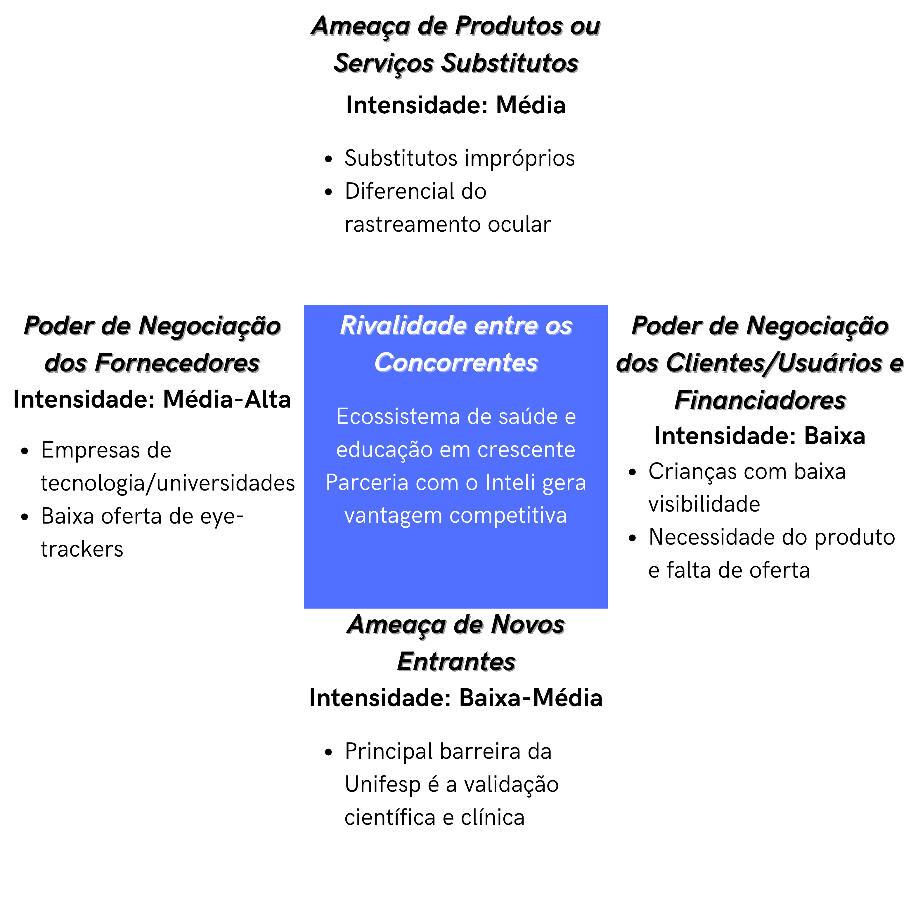<br>
 <sub>Fonte: Material produzido pelos autores (2026)</sub><br><br></div>

Dentre os pontos destacados na imagem, são revelados os pontos a seguir:

**Rivalidade entre os Concorrentes:**
 - O ecossistema de inovação que une saúde e educação tem crescido consideravelmente. A Unifesp compete por destaque e fundos de inovação com outras grandes universidades públicas e privadas (como USP e Unicamp), além de EdTechs e HealthTechs focadas em acessibilidade;
 - A parceria com o Inteli cria uma vantagem competitiva ágil, unindo a validação clínica, pedagógica e a autoridade científica da Unifesp com a capacidade de execução tecnológica rápida do Inteli.

**Ameaça de Produtos ou Serviços Substitutos:**
 - Os substitutos incluem o ensino tradicional sem acessibilidade ou ensino adaptado com falta de elementos de entretenimento, além das outras possibilidades de tecnologias que não são focadas para o ensino médio;
 - Diferencial: O jogo integrado ao eyetracker atua de forma inovadora ao gamificar a terapia e a aprendizagem. Ele substitui métodos muitas vezes exaustivos por uma experiência interativa, reduzindo o risco de abandono por parte das crianças.

**Ameaça de Novos Entrantes:**
  - Barreira de proteção: A principal barreira que a Unifesp impõe é a validação científica e clínica. Novos entrantes podem ter facilidade em programar um jogo, mas terão grande dificuldade em obter o rigor médico, o acesso aos pacientes (crianças com baixa visão) para testes e o embasamento pedagógico que uma instituição de saúde e ensino referência já possui.

**Poder de Negociação dos Fornecedores:**
 - Neste projeto específico, os fornecedores englobam as empresas de hardware que possuem eye trackers e fornecedores de conteúdo educacional como a universidade;
 - O maior risco é causado pela baixa oferta de eye-trackers causando um elevado preço, e a falta de opções no mercado brasileiro causando a necessidade de importação de produtos internacionais como da empresa sueca Tobii.

**Poder de Negociação dos Clientes/Usuários e Financiadores:**
 - Os "clientes" finais são as crianças com baixa visão, suas famílias, escolas e clínicas;
 - Hoje, graças a falta de oferta combinada com a urgência e necessidade do produto, entendemos que o nosso público alvo oferece baixo risco de causar pressão sobre o preço ou demanda dos nossos serviços, apenas devemos garantir a acessibilidade e qualidade.

A aplicação das 5 Forças de Porter ao nosso projeto revela um cenário estratégico favorável, consolidado pela solidez da parceria entre a Unifesp e o Inteli. A análise demonstra que a barreira de entrada, fundamentada na validação técnico-científica e no acesso qualificado aos usuários, é um ativo estratégico que nos blinda frente a competidores que possuem apenas a capacidade tecnológica, mas carecem de autoridade clínica e pedagógica. 
Embora o poder de negociação dos fornecedores de hardware represente um desafio logístico e financeiro, a escassez de soluções acessíveis e focadas no Ensino Médio coloca o projeto em uma posição de destaque singular. Em última análise, ao contornar as limitações do mercado atual e oferecer uma experiência que une gamificação, acessibilidade e embasamento científico, o projeto não apenas se torna viável, mas projeta-se como uma iniciativa disruptiva com alto potencial de escala e impacto real na educação e na vida de jovens com baixa visão.


### 1.1.2. Análise SWOT


A análise SWOT foi aplicada ao projeto do jogo em parceria com a UNIFESP, considerando fatores internos e externos que podem impactar seu desenvolvimento. Ela permite avaliar o contexto estratégico em que o jogo está inserido.


<div align="center">
 Figura 2: Análise SWOT<br><br>
 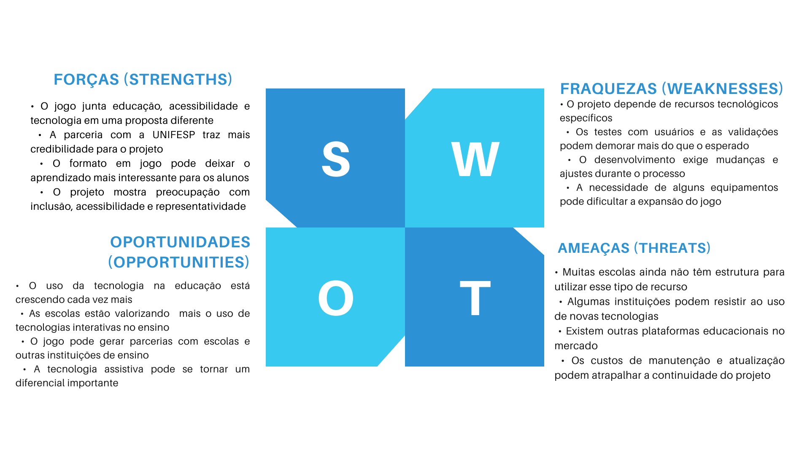<br>
 <sub>Fonte: Material produzido pelos autores (2026)</sub><br><br>
</div>

O projeto do jogo possui pontos fortes, como credibilidade institucional e alinhamento com educação inclusiva. Porém, enfrenta desafio como dependência de tecnologia específica. Mesmo assim, o crescimento da tecnologia educacional cria um cenário favorável para sua continuidade e expansão.


### 1.1.3. Missão / Visão / Valores

**Missão:** Democratizar o ensino de física e astronomia por meio de uma experiência tecnológica inclusiva, oferecendo ferramentas lúdicas que rompam barreiras motoras e visuais, transformando o aprendizado em uma jornada de autonomia e descoberta.

**Visão:** Tornar-se uma referência em tecnologia assistiva no ambiente escolar, liderando a transformação de matérias complexas em conteúdos acessíveis e envolventes, consolidando a ideia de que o estudo lúdico pertence a todos, independentemente de suas limitações físicas.

**Valores:** Atuar com empatia no design, rigor científico na física, inconformismo diante da exclusão educacional e simplicidade na interface, prezando sempre pela ética na inclusão e pela transparência no processo de aprendizagem.

### 1.1.4. Proposta de Valor

O **Canvas de Perfil do Cliente** faz parte da etapa de observação do ***Value Proposition Canvas***, ferramenta idealizada por Alexander Osterwalder[¹](#7-referências) para mapear o universo do usuário. Esta "metade direita" do diagrama foca em compreender as tarefas, dores e ganhos reais do público-alvo, antes mesmo de se definir a solução técnica. O objetivo central é garantir o fit estratégico, assegurando que os recursos do jogo educacional respondam precisamente às necessidades e desafios das crianças usuárias de *Eye Tracker*.
Veja abaixo o **Canvas de Perfil do Cliente** do nosso projeto:

<div align="center">
 Figura 3: Proposta de Valor<br><br>
 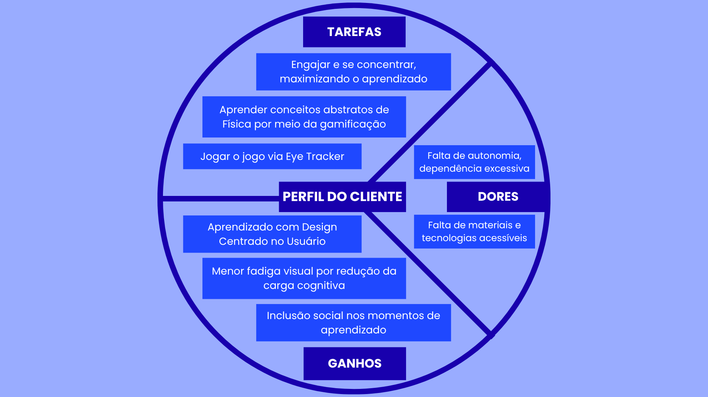<br>
 <sub>Fonte: Material produzido pelos autores (2026)</sub><br><br>
</div>

Além do **Canvas de Perfil do Cliente**, dentro do *framework* de Alexander Osterwalder, também existe o **Mapa de Valor**, a contraparte que descreve como a solução será estruturada. Esta etapa foca em listar os produtos e serviços oferecidos, detalhando como eles atuam especificamente como aliviadores de dores e criadores de ganhos para o usuário. Ao confrontar essas duas metades, o grupo consegue validar o fit entre as funcionalidades do jogo e as reais limitações e desejos das crianças que utilizam o *Eye Tracker*.
Veja abaixo o **Mapa de Valor** do nosso projeto:

<div align="center">
 Figura 4: Mapa de Valor<br><br>
 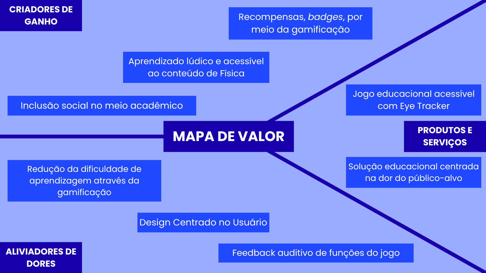<br>
 <sub>Fonte: Material produzido pelos autores (2026)</sub><br><br>
</div>

Nosso projeto parte da identificação de **dores** centrais do público-alvo, como a falta de autonomia, a dependência excessiva e a escassez de tecnologias educacionais acessíveis. Para responder a esses desafios, propõe-se um jogo educacional operado por *Eye Tracker*, desenvolvido com base no **Design Centrado no Usuário** e nos princípios do **Design Universal**, garantindo uma interação intuitiva, acessível e adaptada às limitações motoras e cognitivas das crianças.

A **solução** atua diretamente como aliviadora dessas dores ao permitir que o usuário interaja com o sistema de forma mais independente, reduzindo a necessidade de mediação constante. Além disso, o uso de gamificação para ensinar conceitos abstratos de Física torna o aprendizado mais envolvente e compreensível, aumentando o engajamento e facilitando a assimilação de conteúdos complexos.

Como resultado, os **ganhos** são claros: maior engajamento e concentração, redução da fadiga visual e da carga cognitiva e promoção da inclusão social no aprendizado. Por fim, nosso projeto demonstra um forte alinhamento entre necessidades do usuário e solução proposta, evidenciando um sólido *fit* de valor dentro do escopo definido pela **Unifesp**.

### 1.1.5. Descrição da Solução Desenvolvida

Observa-se um avanço progressivo no desenvolvimento de tecnologias assistivas voltadas à autonomia em atividades da vida diária, exemplificado pela implementação de cadeiras de rodas motorizadas[¹](#7-referências). Contudo, essa evolução tecnológica não se manifesta de forma igual em todos os setores; o campo da educação, por exemplo,ainda carece de metodologias e recursos pedagógicos com o grau de especialização necessário para assegurar a estudantes com deficiência um processo de aprendizagem equivalente ao oferecido aos demais alunos[²](#7-referências).

Visando mitigar as lacunas na educação inclusiva, o Astra foi desenvolvido como uma solução tecnológica voltada ao ensino de Astronomia e Astrofísica. A escolha desta área fundamenta-se em evidências de que estudantes enfrentam obstáculos significativos na compreensão de conceitos abstratos, os quais demandam elevado esforço cognitivo.Isso pode ser comprovado por uma pesquisa realizada pela Organização para a Cooperação e Desenvolvimento Econômico (OCDE)[³](#7-referências).

Nosso projeto é um jogo criado para democratizar o acesso ao conhecimento, permitindo que o usuário controle um avatar em diferentes astros, interagindo com personagens não jogáveis (NPCs) e superando desafios em mini jogos pedagógicos. Sob a ótica da tecnologia assistiva, o software foi projetado para operar exclusivamente via cursor (mouse). Essa arquitetura de controle permite a integração direta com dispositivos de Eye Tracking[⁴](#7-referências), viabilizando a jogabilidade e o aprendizado autônomo para estudantes com severas limitações motoras.


### 1.1.6. Matriz de Riscos

A **Matriz de Riscos** é um *framework* de gestão estratégica utilizado para identificar, analisar e priorizar as incertezas de um projeto. Segundo os padrões do **PMI (Project Management Institute)**[¹](#7-referências), a ferramenta cruza a probabilidade de ocorrência de um evento com o seu impacto. Essa análise resulta em um escore de criticidade que permite classificar as ameaças em níveis de severidade.

A leitura da matriz fundamenta a tomada de decisão: eventos de alta probabilidade e alto impacto são classificados como **críticos**, exigindo respostas imediatas. Inversamente, eventos com baixos índices em ambos os fatores são considerados de **baixo risco**. Já as combinações intermediárias, como alto impacto com baixa probabilidade, definem o **risco médio**.

Veja abaixo a Matriz de Riscos do nosso projeto:


<div align="center">
 Figura 5: Matriz de Riscos<br><br>
 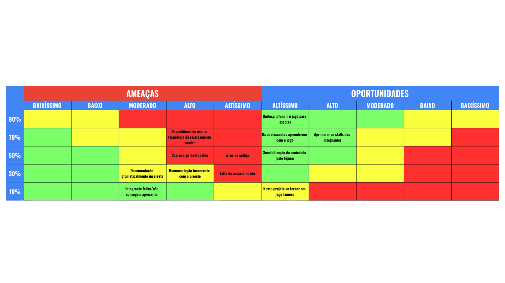<br>
 <sub>Fonte: Material produzido pelos autores (2026)</sub><br><br>
</div>


### Ameaças

#### 1. Documentação gramaticalmente incorreta (Risco do trabalho em grupo)
- **Impacto:** Moderado  
- **Classificação:** Interno
- **Probabilidade:** 30%  
- **Descrição:** Erros gramaticais na documentação demonstrarão um trabalho mal feito por parte dos nossos membros, impactando a credibilidade de nosso projeto.  
- **Responsável:** Membros do grupo  
- **Plano de Ação:** Utilizar ferramentas de Inteligência Artificial para corrigir a gramática e, além disso, adicionar tarefas de revisão para outros integrantes do grupo revisarem a gramática uns dos outros.  

#### 2. Documentação incoerente com o projeto (Risco do trabalho em grupo)
- **Impacto:** Alto  
- **Classificação:** Interno
- **Probabilidade:** 30%  
- **Descrição:** O fato de a documentação não apresentar coerência com nossa proposta demonstraria descuido dos indivíduos do grupo, podendo acarretar em uma avaliação negativa, demandando tempo para retrabalhar essas seções e, principalmente, descredibilizando nosso projeto.  
- **Responsável:** Membros do grupo  
- **Plano de Ação:** Organizar o Kanban de forma a assegurar que nenhuma parte seja finalizada sem revisão de coerência feita por outro integrante.  

#### 3. Erros de código (Risco do trabalho em grupo)
- **Impacto:** Altíssimo
- **Classificação:** Interno
- **Probabilidade:** 50%  
- **Descrição:** Erros no código do jogo quebrarão toda a proposta de, ao fim das 10 semanas, entregar um jogo inicial funcional, um MVP (Produto Mínimo Viável).  
- **Responsável:** Membros do grupo  
- **Plano de Ação:** Revisão dos códigos em busca de erros. Nesse processo, o revisor pode ter o auxílio de uma Inteligência Artificial que o ajude a encontrar esses “bugs”.  

#### 4. Sobrecarga de trabalho (Risco do trabalho em grupo)
- **Impacto:** Alto
- **Classificação:** Interno
- **Probabilidade:** 50%  
- **Descrição:** A desigualdade na divisão das tarefas do nosso grupo acarretará na exaustão de alguns integrantes, enquanto outros poderiam realizar essas tarefas, podendo gerar uma bola de neve de tarefas atrasadas.  
- **Responsável:** Scrum Master da semana  
- **Plano de Ação:** Designar as tarefas para os membros do grupo com base nas horas de trabalho individuais.  

#### 5. Integrante faltar/não conseguir apresentar (Risco do trabalho em grupo)
- **Impacto:** Moderado
- **Classificação:** Interno
- **Probabilidade:** 10%  
- **Descrição:** Nos casos de algum integrante não comparecer em uma das apresentações, enfrentaremos dificuldades ao inserir um membro que não esperava realizar essa função.  
- **Responsável:** Membro da apresentação da “Sprint”  
- **Plano de Ação:** Preparar de dois a três membros como “backup” para apresentar caso algum dos responsáveis não possa apresentar.  

#### 6. Falta de acessibilidade (Risco de Stakeholder e Usabilidade/Acessibilidade)
- **Impacto:** Altíssimo
- **Classificação:** Interno
- **Probabilidade:** 30%  
- **Descrição:** A falta de acessibilidade desrespeitaria um dos pilares do projeto, que é ser acessível a adolescentes com baixa visão que estão no Ensino Médio.  
- **Responsável:** Membros do grupo  
- **Plano de Ação:** Realizar pesquisas sobre acessibilidade e, nas “Sprints Review”, aproveitar o conhecimento dos profissionais do Departamento de Oftalmologia da Unifesp (Universidade Federal de São Paulo) para aprimorar a acessibilidade do nosso projeto.  

#### 7. Dependência do uso da tecnologia de rastreamento ocular (Risco Tecnológico)
- **Impacto:** Alto  
- **Classificação:** Externo
- **Probabilidade:** 70%  
- **Descrição:** A dependência de dispositivos “Eye Tracker” faz com que nosso projeto esteja vulnerável a ser dispensado. Apesar de essa tecnologia existir, ela ainda é muito recente e, por isso, possui um valor de mercado considerado elevado.  
- **Plano de Ação:** Projetar nosso jogo com o maior nível de acessibilidade possível para que ele seja jogável em quaisquer níveis de tecnologias de rastreamento ocular.


### Oportunidades

#### 1. Os adolescentes aprenderem com o jogo (Oportunidade Pedagógica)
- **Impacto:** Altíssimo  
- **Classificação:** Interno e Externo
- **Probabilidade:** 70%  
- **Descrição:** Se os usuários aprenderem com o jogo, atingiremos nosso objetivo completo de ser um jogo educacional acessível, ajudando a incluir nosso público-alvo na sociedade.  
- **Plano de Ação:** Verificar, por meio de pesquisas pedagógicas e com os parceiros do projeto, se estamos no caminho certo e, caso não estejamos, buscar formas de levar educação a esses adolescentes.  

#### 2. Unifesp difundir o jogo para escolas (Oportunidade de Stakeholder, Pedagógico e de Engajamento)
- **Impacto:** Altíssimo 
- **Classificação:** Externo 
- **Probabilidade:** 90%  
- **Descrição:** Conforme discutido entre nosso PO (“Product Owner”) e os parceiros do projeto, o Departamento de Oftalmologia da Unifesp deseja validar os jogos do nosso Ateliê e integrá-los a algumas escolas para difundir a inclusão do nosso público-alvo no meio educacional.  
- **Plano de Ação:** Entregar um projeto bem feito e coerente com a dor inicial dos parceiros.  

#### 3. Aprimorar as skills dos integrantes (Oportunidade de trabalho em grupo)
- **Impacto:** Alto  
- **Classificação:** Interno
- **Probabilidade:** 70%  
- **Descrição:** O aprimoramento das “soft” e “hard” skills dos integrantes do grupo contribuiria para o desenvolvimento individual no mercado de trabalho.  
- **Plano de Ação:** Instruir o grupo de forma a uni-los para que repassem “feedbacks” uns aos outros.  

#### 4. Sensibilização da sociedade pelo tópico (Oportunidade de Engajamento)
- **Impacto:** Altíssimo  
- **Classificação:** Externo
- **Probabilidade:** 50%  
- **Descrição:** Se nosso jogo se tornar relevante em um cenário regional ou até mesmo nacional, isso fará com que a sociedade olhe com outros olhos para um tema tão sensível quanto a acessibilidade na adolescência.  
- **Plano de Ação:** Aperfeiçoar nosso projeto para que os parceiros possam divulgá-lo para mais instituições de ensino.  

#### 5. Nosso projeto se tornar um jogo famoso (Oportunidade de Engajamento)
- **Impacto:** Altíssimo  
- **Classificação:** Externo
- **Probabilidade:** 10%  
- **Descrição:** A popularização do nosso projeto atrairia olhares para a dor do Departamento de Oftalmologia da Unifesp, a falta de acessibilidade no meio educacional na faixa etária dos adolescentes. Tal fato poderia acarretar em mais projetos voltados a essa problemática.  
- **Plano de Ação:** Aperfeiçoar nosso projeto para que este venha a ser um exemplo de criação nesse meio.  


Embora apresente vulnerabilidades técnicas críticas em relação à acessibilidade e à dependência de hardware, nossa Matriz de Riscos revela um projeto de alto impacto social com oportunidades sólidas de expansão institucional por meio da nossa parceira, a Unifesp.

Para mitigar essas ameaças, priorizaremos processos de revisão cruzados e o uso Inteligente de Inteligência Artificial, assegurando a integridade do código e a qualidade da documentação.

Por fim, nossa gestão estratégica focará em converter o potencial educativo do jogo em um MVP funcional que equilibre inovação tecnológica com a viabilidade prática para o público-alvo.

### 1.1.7. Objetivos, Metas e Indicadores

Os ***objetivos estratégicos*** do projeto consistem em promover o **aprendizado** eficaz de conceitos fundamentais de Física para adolescentes do Ensino Médio por meio de um jogo 2D educativo interativo, garantindo que o conteúdo seja compreendido e aplicado de forma significativa. Além disso, buscamos assegurar a **acessibilidade** e **inclusão**, permitindo que usuários com limitações visuais consigam utilizar o jogo de maneira autônoma. Por fim, o projeto também tem como objetivo reduzir barreiras de usabilidade e o esforço cognitivo, oferecendo uma experiência intuitiva, clara e engajadora para todos os usuários.

O ***framework*** **SMART**[¹](#7-referências) é uma metodologia para definir metas de forma clara e estruturada. Ele se baseia em cinco critérios base: **específica**, **mensurável**, **alcançável**, **relevante** e **temporal**, os quais auxiliam a tornar os objetivos mais bem definidos e realistas, além de permitirem acompanhar o progresso de forma eficiente. Assim, se utilizado corretamente, seu uso aumenta as chances de sucesso no planejamento e execução de projetos. Veja abaixo duas Metas do nosso projeto: 

**Meta 1:** Garantir o aprendizado do público-alvo.
 - ***Specific* (Específica):** Garantir que adolescentes do Ensino Médio compreendam e apliquem conceitos fundamentais de Física por meio da interação com um jogo 2D educativo.

 - ***Measurable* (Mensurável):** O aprendizado será considerado alcançado quando pelo menos 70% dos usuários acertarem 80% ou mais das questões e os jogadores completarem todas as fases e minijogos propostos em um tempo abaixo do tempo que fizeram em seu primeiro contato com o jogo.

 - ***Achievable* (Alcançável):** A equipe será responsável por garantir o aprendizado por meio do desenvolvimento de conteúdos alinhados a Base Nacional Comum Curricular do Ensino Médio, implementação de feedback imediato no jogo e uso de metodologias ativas e interativas baseadas em estudos pedagógicos.

 - ***Realistic* (Realista):** A meta é viável considerando o escopo educacional do jogo (MVP com conteúdo focado), os recursos disponíveis (tempo, equipe e conhecimento técnico, por exemplo) e a utilização de mecânicas simples e eficazes de ensino-aprendizagem.

 - ***Time Bound* (Temporal):** O aprendizado do público-alvo deverá ser validado até a data da apresentação final (10 de abril), com testes realizados previamente durante a fase final do desenvolvimento.

**Meta 2:** Garantir acessibilidade ao público-alvo
 - ***Specific* (Específica):** Garantir que o jogo 2D educativo seja acessível a adolescentes do Ensino Médio com diferentes necessidades, incluindo limitações visuais, auditivas e cognitivas, por meio de recursos de usabilidade, interface inclusiva e adaptações pedagógicas.

 - ***Measurable* (Mensurável):** A acessibilidade será considerada alcançada quando o jogo oferecer funcionalidades como legendas, ajustes de contraste e tamanho de texto, além de apresentar navegação intuitiva, sendo validado por testes em que pelo menos 70% dos usuários consigam utilizar todas ou a maioria das funcionalidades sem dificuldades significativas.

 - ***Achievable* (Alcançável):** A equipe será responsável por implementar práticas de acessibilidade durante o desenvolvimento, incluindo design minimalista, programação de recursos adaptativos e validação com base em diretrizes reconhecidas, utilizando os conhecimentos adquiridos ao longo do projeto.

 - ***Realistic* (Realista):** A meta é viável dentro do escopo do MVP, com soluções simples de acessibilidade compatíveis com os recursos e o tempo disponíveis.

 - ***Time Bound* (Temporal):** A garantia de acessibilidade também deverá ser implementada e validada até a apresentação final do projeto, no dia 10 de abril, incluindo testes prévios com usuários para verificação da efetividade das soluções adotadas. 

Para garantir a efetividade do projeto, estruturamos as metas com o *framework* **SMART** e vinculamos diretamente os **KPIs** a elas, assegurando uma avaliação objetiva dos resultados. A **meta de aprendizado** é acompanhada pelo *percentual de aprovação*, *taxa de conclusão* e *tempo médio de uso*, enquanto a **meta de acessibilidade** se relaciona ao *nível de usabilidade* e ao *nível de satisfação dos usuários* percebido pelos usuários. Dessa forma, os KPIs funcionam como evidências diretas do alcance das metas, permitindo monitoramento contínuo e alinhado aos objetivos do projeto.

## 1.2. Requisitos do Projeto

\#| Requisito
--- | ---
1 | O jogo deve ser configurado usando a ideia de point and click para maior adaptabilidade ao Eye Tracker.
2 | O jogo deve ter leitura guiada, em que o jogador pode ou não utilizá-la para ouvir as perguntas.
3 | O jogo deve apresentar uma arte minimalista e cores limpas para melhor identificação por parte dos usuários com deficiências visuais.
4 | O jogo deve apresentar três mecânicas principais: (1) olhar fixamente para um elemento visual e dar zoom, (2) o personagem/nave seguir o olhar do usuário e (3) desviar de meteoros, que serão utilizadas ao longo de toda a gameplay.
5 | O jogo deve apresentar diversas perguntas no meio de um desafio de esquivar de meteoritos para testar os conhecimentos do jogador.
6 | O jogo deve apresentar um desafio de chuva de meteoros, em que ao entrar em contato com um meteoro, o player terá acesso a uma pergunta para poder eliminar o objeto e continuar navegando.
7 | O jogo deve descontar uma barra de propelente para cada pergunta que o jogador errar
8 | O jogo deve reiniciar caso o player perca 3 barras de propelente.
9 | O jogo deve apresentar um desafio após a chuva de meteoros, em que a nave será desgastada e deverá entrar no planeta Marte para exploração e reconstrução, para assim aprender sobre o planeta enquanto se diverte.

## 1.3. Público-alvo do Projeto

Em parceria com o Departamento de Oftalmologia da UNIFESP, Universidade Federal de São Paulo, nosso projeto pretende integrar matérias do Ensino Médio a adolescentes com deficiência visual por meio de jogos não infantilizados. O público-alvo de nossa iniciativa são adolescentes na faixa etária de 14 a 17 anos, mas não necessariamente restritos. Temos como objetivo integrá-los a um jogo que os ensina e os ajuda a revisar conteúdos programáticos do Ensino Médio. Dentro de nossa proposta, temos como prioridade total a acessibilidade a esse conteúdo e, além disso, não infantilizar o jogo, atendendo ao desejo daqueles que o utilizarão.
Idade: 14 a 17 anos.
Perfil: Estudantes do Ensino Médio.
Motivação: Integração não infantilizada de adolescentes com deficiência visual ao conteúdo do Ensino Médio.

# <a name="c2"></a>2. Visão Geral do Jogo

## 2.1. Objetivos do Jogo

O objetivo principal do jogo é ensinar conteúdos da base curricular do Ensino Médio a adolescentes com deficiência visual. Em nosso jogo, o jogador estudará temas como a origem do universo, a cinemática e os planetas do Sistema Solar, inserindo-se totalmente em uma das áreas mais fascinantes do conhecimento: a Física. Nesse contexto, pretendemos criar um projeto gamificado, mas não infantil, contemplando um dos desejos dos usuários, uma vez que a maioria dos jogos existentes é infantilizada, o que não desperta muito interesse nos adolescentes. A experiência do usuário é projetada para ter um nível de dificuldade moderado, oferecendo um desafio equilibrado, de modo que possamos integrar a tecnologia de eye tracker ao nosso jogo.

## 2.2. Características do Jogo

### 2.2.1. Gênero do Jogo

Astra é um jogo de aventura espacial educativa que funde simulador de navegação, quizzes científicos e exploração planetária, projetado para converter conceitos abstratos da Física em uma experiência tátil e auditiva. Cada manobra entre meteoros é construída para ensinar diferentes conteúdos abordados na área da Astronomia e Astrofísica, desafiando a compreensão teórica dos alunos por meio de uma mecânica de jogo adaptada e inclusiva.

Sua estrutura híbrida entre arcade e exploração educativa coloca o estudante em uma jornada pelo Sistema Solar, na qual o conhecimento é o combustível principal. Aqui, o progresso é medido pela superação de barreiras: o jogador não apenas domina fórmulas, mas desenvolve a percepção espacial e o pensamento científico, aprendendo a matéria de forma muito mais lúdica.

O design é focado integralmente na acessibilidade universal. Mais do que uma escolha estética, o uso de interfaces de alto contraste, comandos simplificados para mobilidade 'reduzida e um design sonoro espacializado (áudio 3D) constitui uma escolha estratégica. Isso garante que a ciência seja democratizada, permitindo que alunos com deficiência motora ou visual naveguem pelo espaço com autonomia, transformando o aprendizado em uma experiência sensorial fluida e, acima de tudo, equitativa.

### 2.2.2. Plataforma do Jogo

Planejado para a máxima inclusão no ambiente escolar, Astra é uma aplicação multiplataforma desenvolvida prioritariamente para notebooks e desktops, mas com total suporte para dispositivos móveis, como tablets e smartphones. Exigindo apenas um sensor ocular (*eye tracker*), o jogo roda diretamente no navegador, necessitando somente de conexão à internet.

### 2.2.3. Número de jogadores

Astra é uma experiência estritamente single-player, na qual o estudante assume o comando absoluto da missão científica. Esse design centrado no indivíduo é fundamental para garantir que o ritmo de aprendizagem e a navegação adaptada respeitem o tempo e as necessidades motoras ou visuais de cada usuário.

### 2.2.4. Títulos semelhantes e inspirações

Inspirado pela jogabilidade de clássicos como [Dino Run](https://trex-runner.com/) e [Flappy Bird](https://flappybird.io/), o projeto adota uma mecânica de desvio de obstáculos que prioriza reflexos e precisão. No que tange à ambientação e ao sentimento de descoberta, as principais referências são [No Man's Sky](https://www.nomanssky.com/), [Galaxy Attack](https://abigames.com.vn/project/galaxy-attack-alien-shooter/) e [Starfield](https://bethesda.net/en/game/starfield), títulos que definem a estética da exploração galáctica moderna e serviram de base para a construção do universo narrativo do jogo.

### 2.2.5. Tempo estimado de jogo

Em média, o jogo dura entre 12 e 15 minutos, podendo variar mais que isso caso o jogador tenha dificuldade de passar pelas fases.

Dentre esses 12 minutos considerados como tempo mínimo para finalizar, cerca de 7 minutos serão de gameplay composta de minigames e perguntas testando a aprendizagem do aluno, e 5 minutos serão de ensino expositivo atráves de textos. Caso o usuário fique mais tempo nas mecânicas com dificuldade, esse tempo poderá ser alongado até 20 minutos de jogo.

# <a name="c3"></a>3. Game Design

## 3.1. Enredo do Jogo

O jogo começa com a visão do Sistema Solar, especificamente do Sol, Mercúrio, Vênus e da Terra. Nesse momento, o jogador pode olhar para os planetas e, ao focar o olhar em um deles, o planeta se move levemente para frente, destacando-se dos demais. No entanto, há uma orientação na tela explicando que o usuário deve selecionar a Terra para continuar o jogo.

Após o usuário selecionar a Terra, inicia-se um tutorial durante o trajeto até o planeta. Nesse momento, o jogador aprende a manipular uma nave espacial enquanto enfrenta uma chuva de asteroides, caracterizando um desafio em que diversos detritos vão em direção à nave. A nave é controlada pelo movimento dos olhos do jogador, com o auxílio do eyetracker. Caso ocorra colisão com algum objeto, um pop-up aparece orientando o jogador a desviar dos asteroides.

Ao chegar à Terra, inicia-se uma dinâmica dentro do planeta. O jogador passa a controlar um astronauta enquanto uma astrofísica o guia e ensina, dentro das instalações da NASA, por meio de diversas atividades, como a construção de uma linha do tempo estelar e um simulador de telescópio, no qual diferentes temas de astronomia são introduzidos e/ou reforçados.

A partir desse desafio, inicia-se um ciclo: após cada exploração, o jogador parte em viagem para o próximo objeto astronômico e, durante o trajeto, enfrenta novas chuvas de meteoros. Nessas situações, ele responde perguntas relacionadas ao planeta visitado anteriormente, consolidando o conhecimento adquirido durante a exploração.

## 3.2. Personagens

### 3.2.1. Controláveis

### NAVE

<div align="center">
 Figura 6: Nave<br><br>
 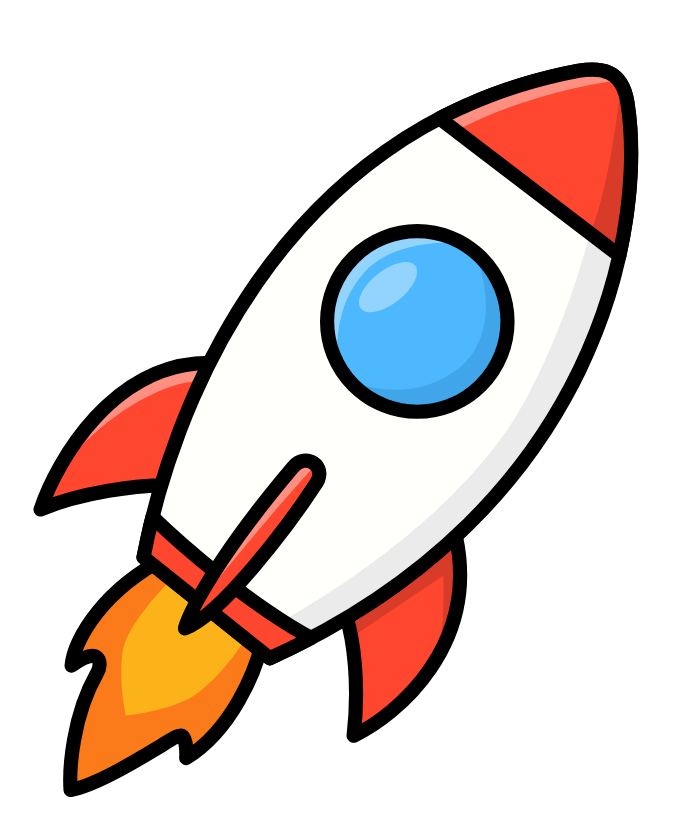<br>
 <sub>Fonte: Material produzido pelos autores (2026)</sub><br><br>
</div>


É uma espaçonave que navegará entre planetas, estrelas, nebulosas e outros corpos celestes. Sua exploração envolve uma pausa na Terra e em Marte, onde o jogador poderá interagir com novos desafios e conteúdos educacionais.

### ASTRONAUTA

<div align="center">
 Figura 7: Astronauta<br><br>
 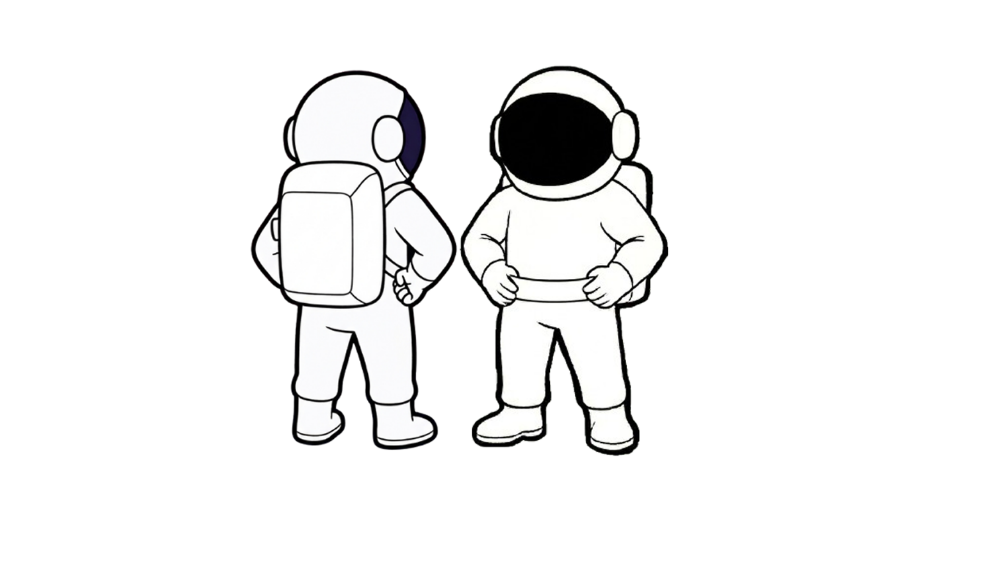<br>
 <sub>Fonte: Material produzido pelos autores (2026)</sub><br><br>
</div>


O astronauta é o personagem principal do jogo e representa o avatar controlado pelo usuário durante toda a experiência. Não há opção de escolha de personagem, sendo esse o único disponível para o jogador.

Seu design foi desenvolvido com foco em acessibilidade para pessoas com baixa visão, utilizando uma paleta de cores simples, composta por preto e branco, para garantir alto contraste. Além disso, o personagem possui contornos bem definidos, facilitando sua visualização durante a jogabilidade.

### 3.2.2. Non-Playable Characters (NPC)

### Astrofísica

<div align="center">
 Figura 8: Astrofísica<br><br>
 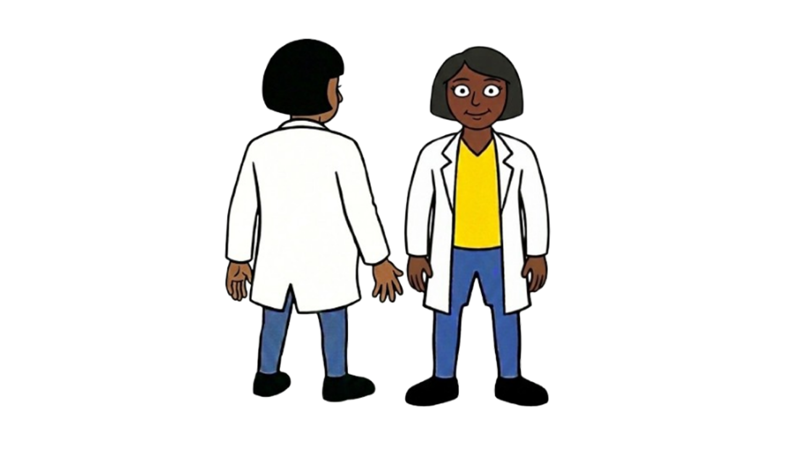
 <sub>Fonte: Material produzido pelos autores (2026)</sub><br><br>
</div>

Após o astronauta aterrissar na Terra, uma astrofísica será a guia do personagem dentro da base da NASA. Essa NPC terá o papel de orientar o jogador durante as atividades, explicando as dinâmicas e o que deve ser feito em cada etapa. Dessa forma, o usuário consegue compreender melhor os conteúdos apresentados e consolidar o conhecimento sobre astronomia ao longo do jogo.

### 3.2.3. Diversidade e Representatividade dos Personagens

O mundo é marcado pela diversidade e, diariamente, convivemos com indivíduos que apresentam diferentes trajetórias em termos de raça, etnia, gênero e religião. No Brasil, essa pluralidade é um pilar central: estudos indicam que a ancestralidade da população é composta por 60% de origem europeia, 27% africana e 13% indígena[¹](#7-referências). Contudo, apesar de a ancestralidade europeia ser numericamente significativa, a população que se autodeclara negra correspondeu a 56,7% dos brasileiros no segundo trimestre de 2024[²](#7-referências). Mesmo diante dessa realidade, casos de racismo ainda são frequentes no país, evidenciando uma estrutura social que precisa ser transformada.

Essa necessidade de representatividade também se estende ao mercado de videogames. Embora existam muitos títulos disponíveis, poucos trazem protagonistas com deficiência física ou propostas pensadas para maior acessibilidade. Um exemplo recente de inclusão é o jogo Drag x Drive[³](#7-referências), que apresenta um personagem com deficiência; no entanto, sua proposta é diferente da do nosso projeto, Astra. Enquanto esse jogo se concentra na prática do basquete, Astra utiliza o ambiente lúdico para promover o ensino de física e astronomia.

Além disso, em diversos videogames a figura feminina ainda é frequentemente retratada de forma estereotipada. Em muitos casos, aparece como frágil ou indefesa, seguindo o arquétipo da “donzela em perigo”, como ocorre em jogos da franquia Super Mario Bros.. Em outras situações, personagens femininas são marcadas por forte sensualização e objetificação. Esse é um cenário que demanda mudanças dentro da indústria de games.

Pensando nisso, buscamos desenvolver personagens que valorizem a representatividade e fujam desses padrões. O elenco jogável contará com um astronauta que representa o usuário durante toda a experiência do jogo. Seu design foi pensado para ser simples e de alto contraste, facilitando a visualização e tornando o personagem mais acessível para jogadores com baixa visão.

Além do protagonista, o jogo inclui um NPC (personagem não jogável), uma astrofísica inspirada em Dorothy Vaughan[⁴](#7-referências), matemática e cientista que teve um papel fundamental na história da NASA. No jogo, essa personagem recepciona o astronauta ao chegar à Terra e atua como guia dentro da base da NASA, orientando o jogador durante as atividades e explicando as dinâmicas propostas.

Com essa abordagem, buscamos garantir que diferentes públicos possam se sentir incluídos e representados na experiência do jogo, fortalecendo a identificação do jogador com a narrativa e com o processo de aprendizado proposto pelo Astra.


## 3.3. Mundo do jogo

### 3.3.1. Locações Principais e/ou Mapas

### Tela Sistema Solar:

O jogo inicia com uma visão em 2D do sistema solar, especificamente o Sol, Mercúrio, Vênus e a Terra. A interface permite que o player selecione os planetas, de modo que, ao serem escolhidos, a câmera realiza um zoom, destacando-o visualmente em relação aos outros.

<div align="center">
 Figura 9: Sistema solar<br><br>
 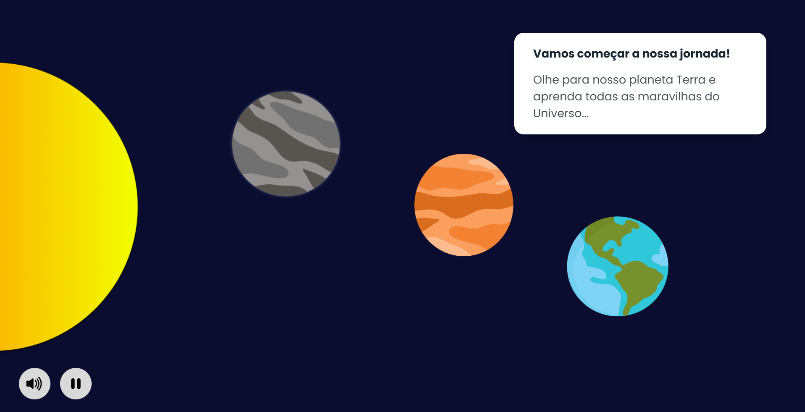<br>
 <sub>Fonte: Material produzido pelos autores (2026)</sub><br><br>
</div>

---

### Tela Tutorial — Caminho Sol-Terra:

Após o usuário selecionar a Terra na tela anterior, inicia-se um tutorial durante o trajeto entre o Sol e a Terra. Nesse momento, o jogador passa a controlar uma nave espacial enquanto é introduzido à mecânica de chuva de asteroides.

O desafio consiste em desviar dos detritos que surgem no caminho. Caso ocorra colisão entre a nave e um asteroide, um pop-up aparece na tela alertando o jogador para tomar cuidado e orientando-o a desviar dos obstáculos, ajudando-o a compreender a dinâmica do jogo e continuar a navegação.

<div align="center">
 Figura 10: Tela tutorial<br><br>
 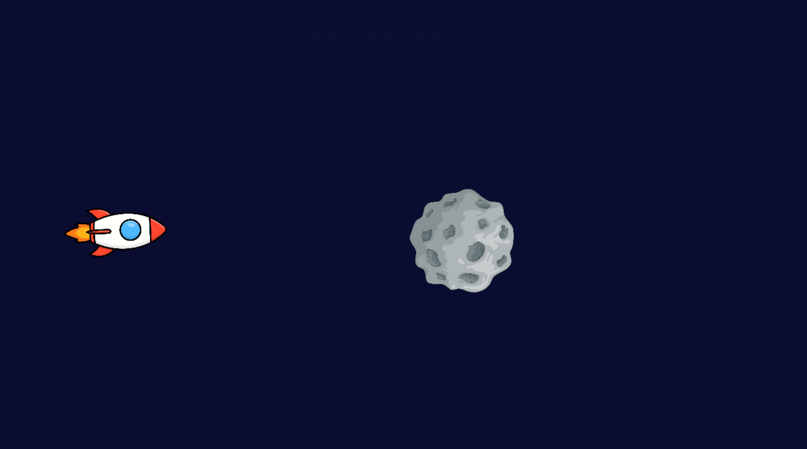<br>
 <sub>Fonte: Material produzido pelos autores (2026)</sub><br><br>
</div>

---

### Centro de Comando de Astronomia Global:

Na chegada à Terra, inicia-se uma dinâmica dentro do planeta, na qual o jogador pode aterrissar sua nave e passar a controlar um astronauta. Nesse momento, uma astrofísica começa a guiar o jogador pelo interior das instalações da NASA, introduzindo-o ao universo da astronomia.

<div align="center">
 Figura 11: Chegada à Terra<br><br>
 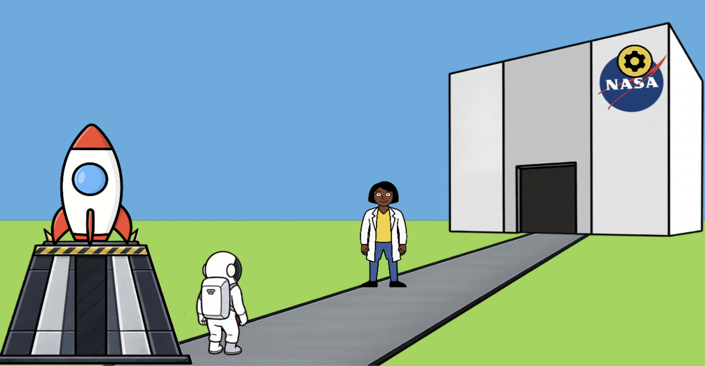<br>
 <sub>Fonte: Material produzido pelos autores (2026)</sub><br><br>
</div>

---

### Tela de Slides — Linha do Tempo Estelar:

Ao adentrar as instalações da NASA, o jogador é apresentado a uma série de conteúdos sobre a linha do tempo do universo e o surgimento de diferentes corpos celestes. A navegação ocorre por meio de slides explicativos acompanhados de áudios, e o jogador pode avançar pelo conteúdo utilizando a mecânica de scroll de texto, consolidando seu aprendizado antes de seguir para o próximo desafio.

<div align="center">
 Figura 12: Slides da cientista<br><br>
 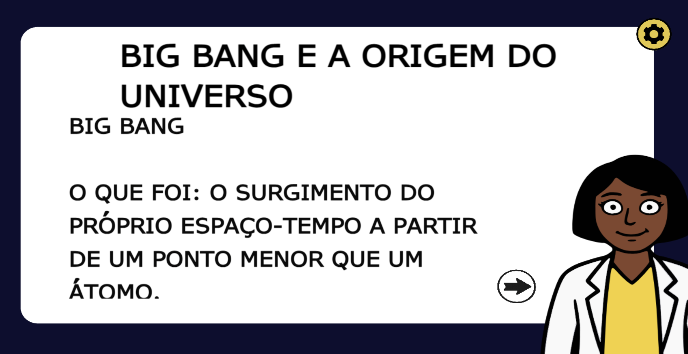<br>
 <sub>Fonte: Material produzido pelos autores (2026)</sub><br><br>
</div>

---

### Mini Jogo — Organização Cronológica:

Com base nos conhecimentos adquiridos nos slides anteriores, o jogador é desafiado a ordenar cronologicamente uma série de eventos representados em cards. Um modal introdutório explica brevemente a mecânica de clique e reposicionamento das cartas, permitindo que o usuário reorganize os elementos até atingir a ordem correta.

<div align="center">
 Figura 13: Mini jogo de organização cronológica<br><br>
 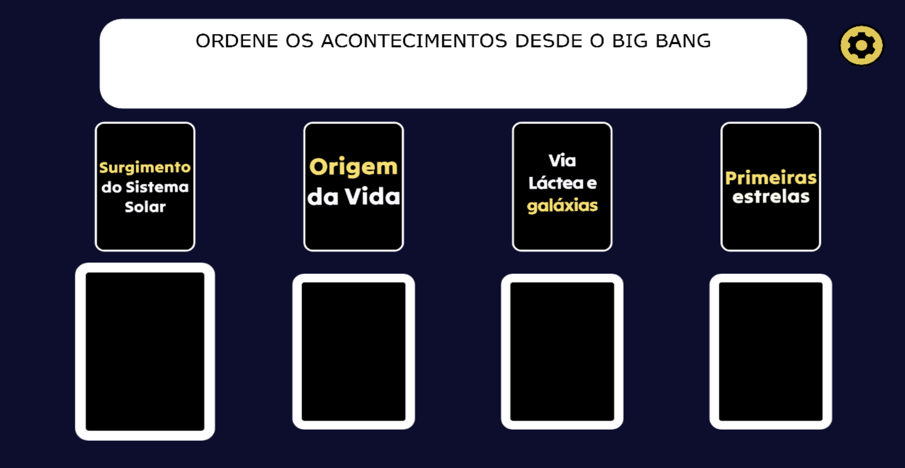<br>
 <sub>Fonte: Material produzido pelos autores (2026)</sub><br><br>
</div>

---

### Tela do Observatório — Telescópio Hubble:

No observatório, o jogador é convidado a conversar com a astrofísica, que apresenta, por meio de slides, conteúdos sobre telescópios, com ênfase especial no telescópio Hubble. Ao final da explicação, o jogador seleciona o telescópio e é transportado para uma visão lúdica e interativa do equipamento, pronto para iniciar uma nova etapa de exploração.

<div align="center">
 Figura 14: Observatório<br><br>
 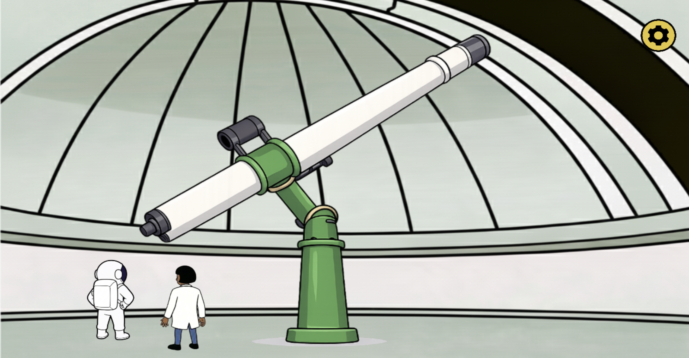<br>
 <sub>Fonte: Material produzido pelos autores (2026)</sub><br><br>
</div>

---

### Mini Jogo — Visão do Telescópio:

Através da lente do telescópio, o jogador pode explorar três fascinantes objetos intergalácticos: um Buraco Negro, a Nebulosa de Órion e a Galáxia de Andrômeda. Uma nova mecânica de aproximação e afastamento é introduzida, permitindo que o usuário ajuste o zoom sobre cada astro explorado e aprofunde sua compreensão sobre cada um deles.

<div align="center">
 Figura 15: Visão do telescópio<br><br>
 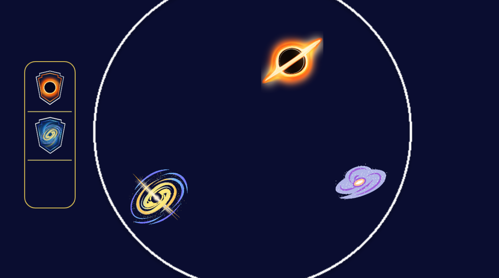<br>
 <sub>Fonte: Material produzido pelos autores (2026)</sub><br><br>
</div>

---

### Tela de Slides — Medindo o Universo:

Após a exploração intergaláctica, o jogador retorna aos slides da astrofísica para aprender sobre os métodos utilizados na astronomia para medir distâncias e o tempo. Nessa etapa, são introduzidos dois conceitos fundamentais: a Unidade Astronômica e o Ano-Luz, preparando o jogador para os desafios que virão a seguir.

<div align="center">
 Figura 16: Slides sobre distâncias astronômicas<br><br>
 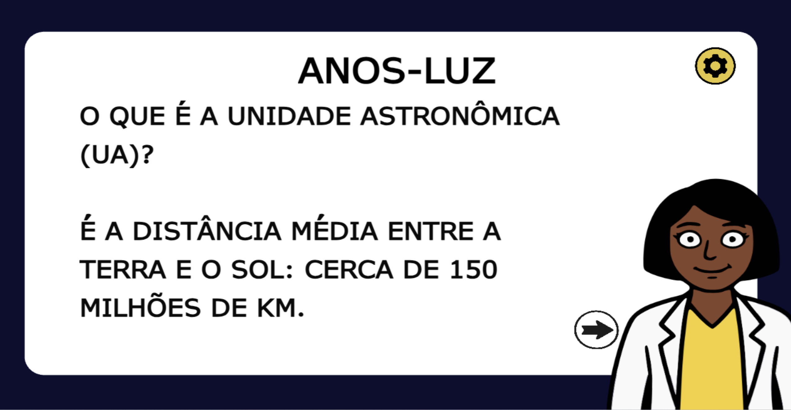<br>
 <sub>Fonte: Material produzido pelos autores (2026)</sub><br><br>
</div>

---

### Mini Jogo — Quiz de Astronomia:

Ao final dos slides, o jogador enfrenta um quiz com perguntas de múltipla escolha — quatro alternativas cada — sobre os conteúdos abordados. Respostas corretas garantem o avanço direto para a próxima pergunta. Em caso de erro, uma das três vidas disponíveis é descontada, mas o jogador ainda avança. Caso perca todas as vidas, o quiz é reiniciado desde o início, oferecendo uma nova chance de consolidar o aprendizado.

<div align="center">
 Figura 17: Quiz de astronomia<br><br>
 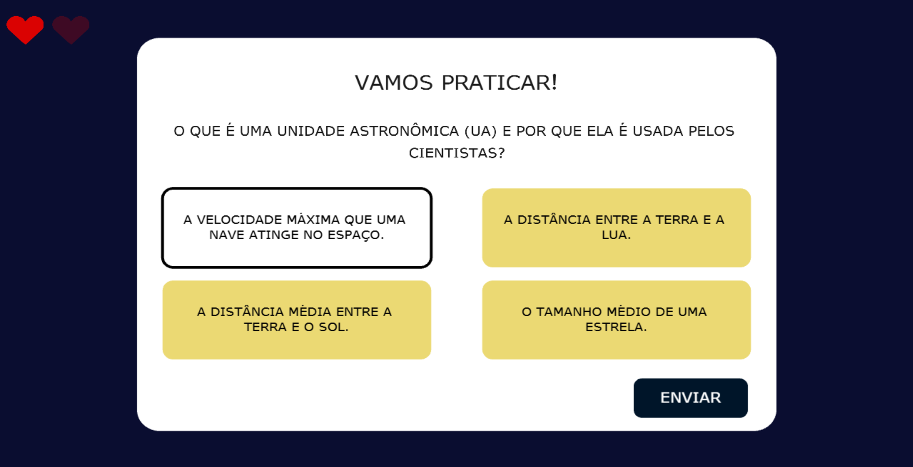<br>
 <sub>Fonte: Material produzido pelos autores (2026)</sub><br><br>
</div>

---

### Tela de Decolagem — Rumo a Marte:

De volta à base da NASA, o astronauta retorna à nave espacial e decola em direção ao próximo destino: Marte. A missão se expande e o jogador parte para uma nova fase da exploração espacial, levando consigo todo o conhecimento adquirido na Terra.

<div align="center">
 Figura 18: Decolagem rumo a Marte<br><br>
 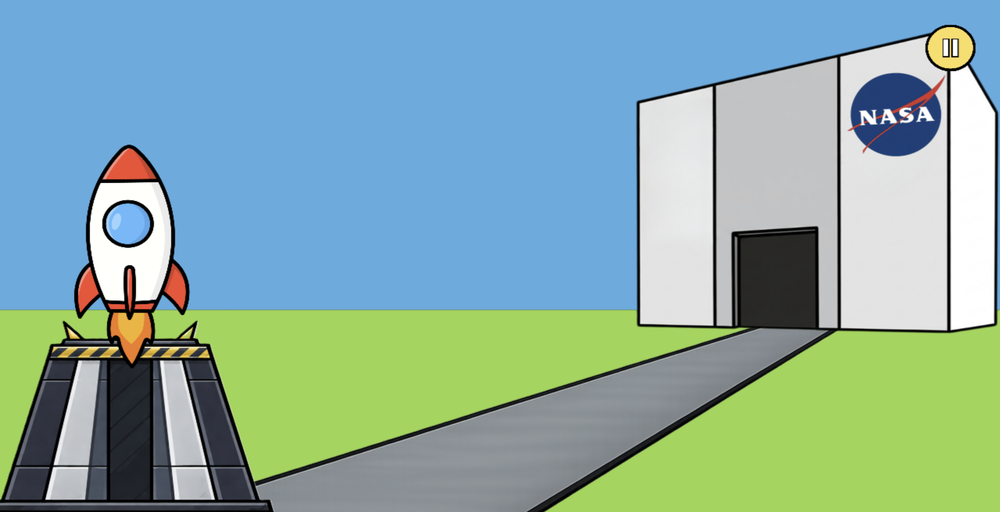<br>
 <sub>Fonte: Material produzido pelos autores (2026)</sub><br><br>
</div>

---

### Mini Jogo — Caminho Terra-Marte:

Durante o trajeto entre a Terra e Marte, uma nova chuva de meteoros desafia o jogador a desviar dos detritos com sua nave. Ao colidir, um modal apresenta um quiz revisando todo o conteúdo abordado na Terra, funcionando como uma oportunidade de consolidação do aprendizado. A lógica de três vidas se aplica novamente: o quiz é reiniciado caso todas sejam perdidas.

<div align="center">
 Figura 19: Caminho Terra-Marte<br><br>
 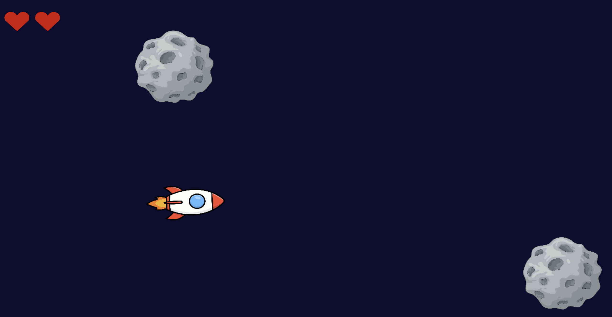<br>
 <sub>Fonte: Material produzido pelos autores (2026)</sub><br><br>
</div>

---

### Tela de Slides — Conhecendo as regiões de Marte:

Antes de pousar no planeta vermelho, o jogador tem a oportunidade de conhecer as diferentes regiões de Marte por meio de um mapa interativo e um novo formato de slides explicativos. Essa etapa prepara o jogador para tomar uma decisão estratégica sobre o melhor local para realizar a aterrissagem.

<div align="center">
 Figura 20: Órbita de Marte<br><br>
 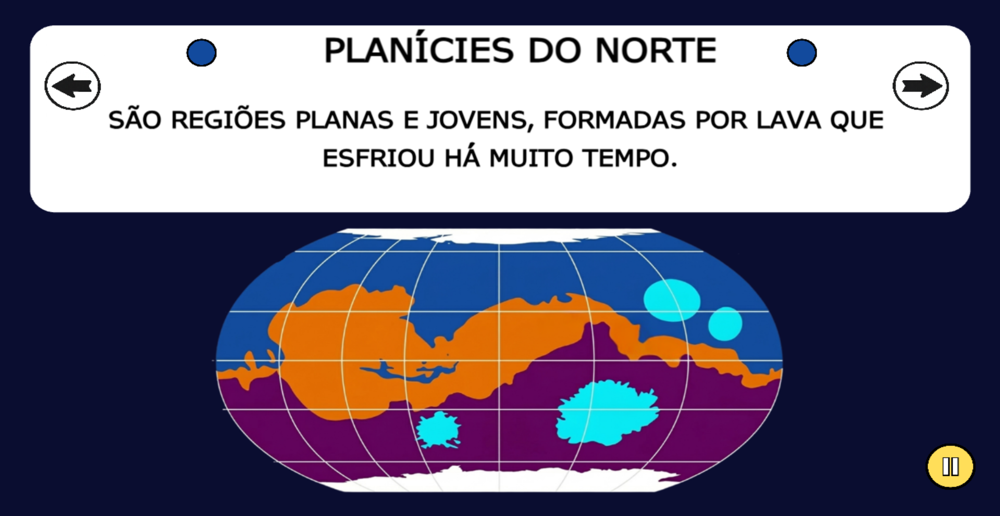<br>
 <sub>Fonte: Material produzido pelos autores (2026)</sub><br><br>
</div>

---

### Mini Jogo — Escolha do Local de Pouso:

Com base nas informações aprendidas sobre as regiões marcianas, o jogador enfrenta um quiz com uma pergunta decisiva: qual é o melhor local para pousar em Marte? A escolha feita nesse momento determina diretamente o ponto de aterrissagem na fase seguinte, tornando o conhecimento adquirido essencial para a progressão.

<div align="center">
 Figura 21: Quiz de escolha do local de pouso<br><br>
 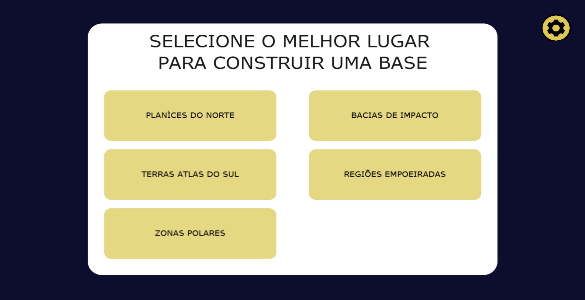<br>
 <sub>Fonte: Material produzido pelos autores (2026)</sub><br><br>
</div>

---

### Tela de Aterrissagem — Marte:

A nave pousa na região escolhida pelo jogador no quiz anterior, e o astronauta pisa em Marte pela primeira vez. Um modal explicativo guia o jogador pelos primeiros passos no planeta vermelho, introduzindo-o à dinâmica de exploração do novo ambiente e preparando-o para interagir com os elementos ao seu redor.

<div align="center">
 Figura 22: Aterrissagem em Marte<br><br>
 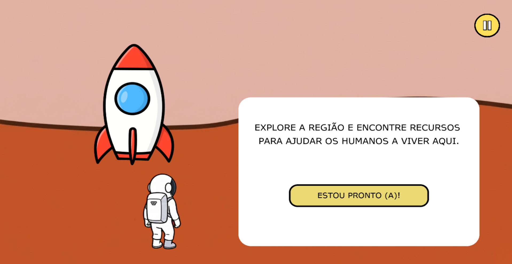<br>
 <sub>Fonte: Material produzido pelos autores (2026)</sub><br><br>
</div>

---

### Mini Jogo — Exploração de Marte:

O jogador tem acesso a um cenário interativo repleto de elementos marcianos a serem descobertos. Ao clicar em cada elemento, um modal explicativo é exibido, acompanhado de áudios que detalham os principais componentes e características do planeta. A exploração é livre, incentivando a curiosidade e o aprendizado ativo.

<div align="center">
 Figura 23: Exploração de Marte<br><br>
 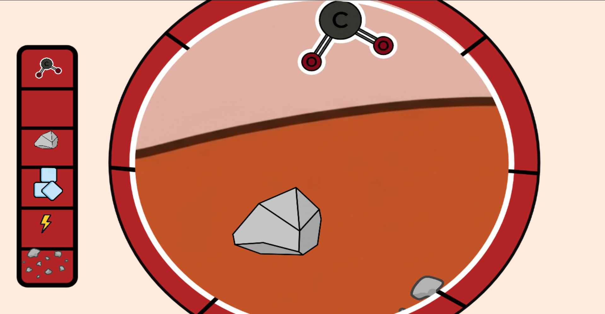<br>
 <sub>Fonte: Material produzido pelos autores (2026)</sub><br><br>
</div>

---

### Mini Jogo — Construção da Base em Marte:

Utilizando os itens coletados durante a exploração marciana e alguns materiais trazidos da Terra, o jogador começa a combinar recursos para construir e ativar uma base habitável em Marte. Essa mecânica de combinação de itens coloca em prática o conhecimento acumulado ao longo da jornada, culminando em uma missão de sobrevivência e engenharia espacial.

<div align="center">
 Figura 24: Construção da base em Marte<br><br>
 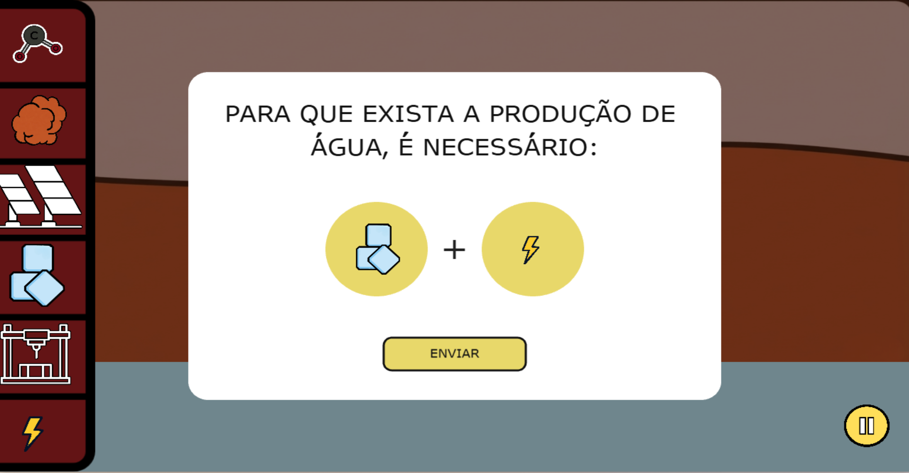<br>
 <sub>Fonte: Material produzido pelos autores (2026)</sub><br><br>
</div>

---

### Tela de Decolagem — Próxima Missão:

Com a base marciana estabelecida, o astronauta retorna à nave e decola novamente, dando continuidade à missão de exploração espacial. O jogador parte para os confins do espaço, carregando consigo toda a experiência e o aprendizado construídos ao longo da jornada.

<div align="center">
 Figura 25: Decolagem de Marte<br><br>
 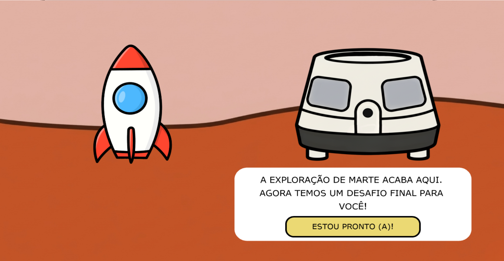<br>
 <sub>Fonte: Material produzido pelos autores (2026)</sub><br><br>
</div>

---

### Mini Jogo — Chuva de Meteoros Final:

Uma última e desafiadora chuva de meteoros aguarda o jogador na reta final da missão. Como nas etapas anteriores, colisões ativam um quiz — desta vez, abrangendo todo o conteúdo do jogo — proporcionando uma revisão completa da experiência. O sistema de três vidas se mantém, e o quiz é reiniciado caso todas sejam perdidas.

<div align="center">
 Figura 26: Chuva de meteoros final<br><br>
 <br>
 <sub>Fonte: Material produzido pelos autores (2026)</sub><br><br>
</div>

---

### Tela Final — Missão Cumprida:

Após superar todos os desafios, o jogador é recebido pela tela final, que celebra sua conquista e parabeniza pela conclusão da missão. Para os que desejam revisitar a aventura, a opção de reiniciar o jogo está disponível nas configurações, convidando o explorador a embarcar novamente nessa jornada pelo universo.

<div align="center">
 Figura 27: Tela final<br><br>
 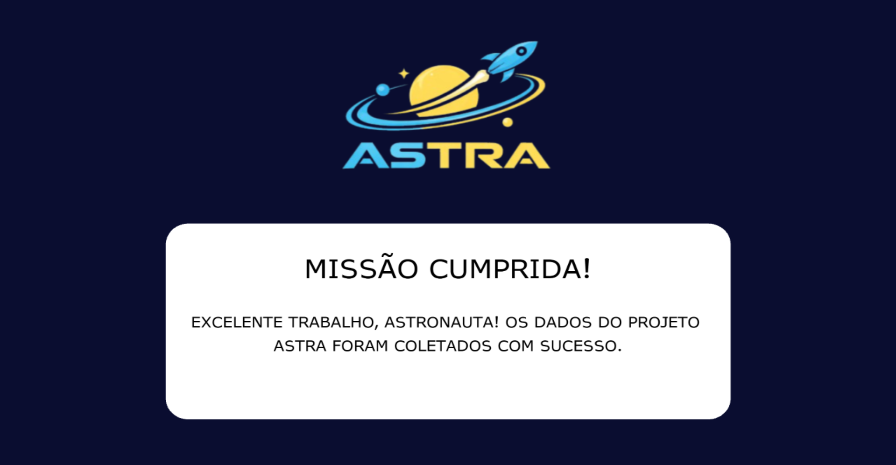<br>
 <sub>Fonte: Material produzido pelos autores (2026)</sub><br><br>
</div>

### 3.3.2. Navegação pelo mundo

O jogo Astra é estruturado em ciclos lineares de exploração e desafio: o jogador avança de um cenário ao seguinte ao cumprir o objetivo proposto em cada fase, sem possibilidade de retorno a telas anteriores. A progressão segue a rota Sistema Solar → Terra → Viagem Terra-Marte → Marte → Desafio Final, e todas as áreas são desbloqueadas automaticamente ao concluir a etapa precedente. A navegação dentro de cada cena é feita exclusivamente pelo cursor do mouse, integrado ao sistema de Eye Tracking.

| Cenário | Descrição | Navegação e Acesso | Interação |
|---|---|---|---|
| **Tela Sistema Solar** | Visão em 2D de alguns planetas do Sistema Solar para seleção do planeta Terra e consulta de materiais para responder a perguntas. | A seleção da Terra é feita através do cursor do mouse, integrado ao sistema de Eye Tracking. | Ao focar e selecionar um planeta, a câmera realiza um zoom e destaca o corpo celeste, expondo o que o aluno deve aprender sobre ele para responder as perguntas posteriormente. |
| **Tela Tutorial** | Sequência de voo onde a nave deve desviar de meteoros no trajeto entre o Sol e a Terra, aprendendo sobre a mecânica do jogo. | A movimentação é feita através do cursor do mouse, integrado ao sistema de Eye Tracking. | Esquiva de detritos espaciais. Em caso de colisão, o jogo pausa e exibe aviso orientando o jogador a desviar. A cena avança automaticamente após 20 segundos ou com a conclusão do trajeto. |
| **Centro de Comando de Astronomia Global** | Base de astronomia na Terra com múltiplas atividades pedagógicas sequenciais, guiadas pela NPC Astrofísica. | Desbloqueado após o tutorial e a animação de aterrissagem. A movimentação do avatar é indicada pela NPC Astrofísica. | O jogador segue a Astrofísica na seguinte sequência: (1) Introdução da guia; (2) Lousa da Linha do Tempo Estelar; (3) Construção da Linha do Tempo Estelar; (4) Lousa do Telescópio; (5) Simulador de Telescópio; (6) Lousa de Anos-Luz; (7) Perguntas sobre UA. Cada etapa concluída desbloqueia a próxima. |
| **Viagem Terra-Marte** | Cena de chuva de meteoros no trajeto entre a Terra e Marte, com perguntas sobre os conteúdos aprendidos na fase anterior. | Acessada automaticamente após a conclusão de todas as atividades no Centro de Comando. A nave avança continuamente; o jogador controla a direção pelo mouse / _Eye Tracker_. | O jogador desvia dos meteoros. Ao colidir, o jogo pausa e exibe uma pergunta de múltipla escolha. Erros consomem vidas (máx. 3); ao perdê-las todas, a cena é reiniciada. Avança após 30 segundos ou ao esgotar as perguntas. |
| **Exploração de Marte** | Fase em Marte com três etapas sequenciais: (1) Escolha da região de pouso; (2) Coleta de recursos com lente; (3) Criação da base espacial. | Desbloqueada automaticamente após a animação de chegada a Marte. Cada subetapa é acessada ao concluir a anterior; não é possível retroceder. | (1) Regiões: o jogador visualiza slides sobre as regiões de Marte e responde a um quiz; em caso de erro, retorna aos slides para tentar novamente. (2) Coleta: a lente revela itens ocultos (CO₂, poeira, rocha, gelo, energia, cinza) — clicar coleta o item e reproduz áudio. (3) Base: combinar pares de recursos para atender aos objetivos; erros exibem dicas orientadoras. |
| **Desafio Final** | Última cena de chuva de meteoros, com perguntas abrangendo todo o conteúdo aprendido ao longo do jogo. Representa o trecho final da jornada da nave. | Acessado automaticamente após o modal de conclusão da Fase Marte. Controle idêntico ao das cenas de chuva anteriores. | Mecânica igual à da Viagem Terra-Marte, com maior dificuldade: apenas 2 vidas e perguntas abrangendo todos os temas. Ao concluir, o jogador é direcionado à tela de parabenização e encerramento. |

### 3.3.3. Condições climáticas e temporais

Nosso jogo é ambientado no espaço sideral, um ambiente que não apresenta condições climáticas ou variações temporais como as observadas na Terra. Por isso, fatores como chuva, variações de temperatura e ciclos de dia e noite não influenciam a dinâmica do jogo, não sendo considerados relevantes para a construção da gameplay.

### 3.3.4. Concept Art

### Personagens do jogo

<div align="center">
 Figura 28: Concept Art Foguete<br><br>
 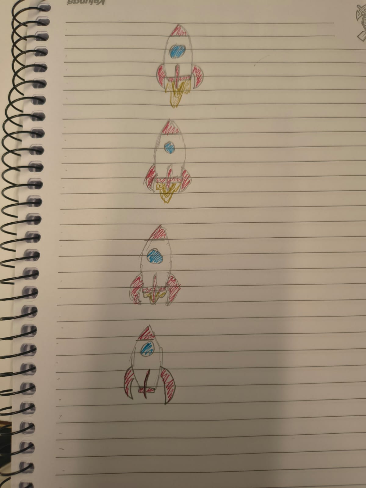<br>
 <sub>Fonte: Material produzido pelos autores (2026)</sub><br><br>
</div>

Essa imagem representa uma concept art da primeira spritesheet do nosso jogo, a animação do foguete descendo. É possível notar isso pela quantidade de fogo que vai diminuindo da primeira imagem para a última

<div align="center">
 Figura 29: Concept Art Personagens<br><br>
 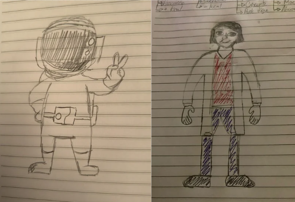<br>
 <sub>Fonte: Material produzido pelos autores (2026)</sub><br><br>
</div>

Essas imagens representam os primeiros traços na criação de personagens do nosso jogo. Na imagem da esquerda, há a representação do astronauta que pilotará a nave , sendo possível vê-lo em algumas fases do jogo e tendo sido pensado do zero por integrantes do grupo. Já na da direita, vemos a personagem Dorothy, inspirada na personagem de mesmo nome no filme "Estrelas Além do Tempo", e ela será a cientista que será encontrada na fase da Terra

### Itens Coletáveis

<div align="center">
 Figura 30: Concept Art - Itens coletáveis <br><br>
 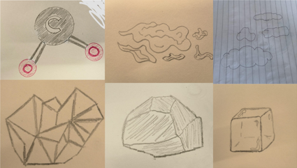<br>
 <sub>Fonte: Material produzido pelos autores (2026)</sub><br><br>
</div>

Esses desenhos são a primeira versão dos itens coletáveis do nosso jogo, que serão pegos na cena cinco de Marte. Esses traços representam elementos que serão usados para formar uma base espacial, como uma rocha, basalto, poeira, molécula de dióxido de carbono, gelo e cinzas vulcânicas. Essa concept art possui traços e cores bem simples, para facilitar a visualização das imagens pelo jogador.

### Mapa do jogo

<div align="center">
 Figura 31: Concept Art<br><br>
 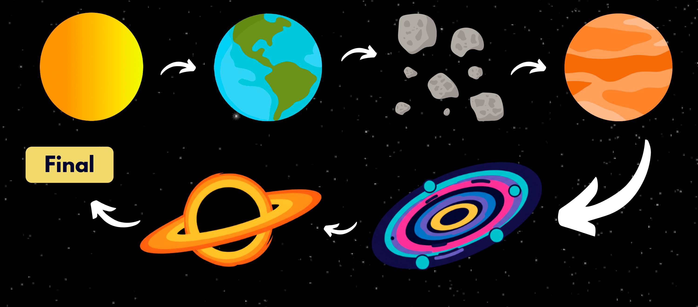<br>
 <sub>Fonte: Material produzido pelos autores (2026)</sub><br><br>
</div>

Esta concepção visual representa o mapa do jogo, com o detalhe dos caminhos e os corpos celestes a serem explorados. O design reflete o objetivo principal do projeto: ser acessível para deficientes visuais, ao usufruir de poucas cores com alto contraste, baixa poluição visual e dinâmicas objetivas, interativas e educacionais.

---

### Tela inicial do jogo 

<div align="center">
 Figura 32: Concept Art - Tela Inicial<br><br>
 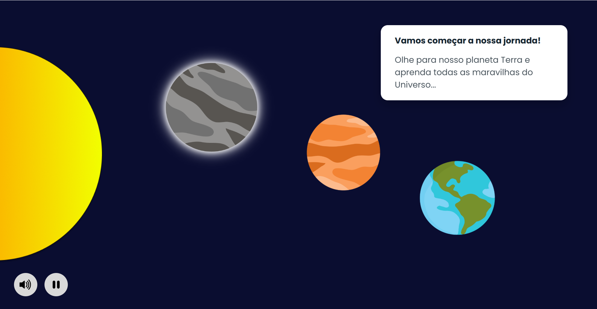<br>
 <sub>Fonte: Material produzido pelos autores (2026)</sub><br><br>
</div>

Esta primeira concepção visual da interface inicial do jogo, com o destaque do planeta Mercúrio, representa o objetivo de buscar elementos simples, como a falta de estrelas e um destaque maior dos planetas em relação aos demais elementos. Assim, demonstra-se preocupação com a legibilidade e acessibilidade ao usuário final.

---

### Tela Mini Tutorial

<div align="center">
 Figura 33: Concept Art - Tela Mini Tutorial<br><br>
 <br>
 <sub>Fonte: Material produzido pelos autores (2026)</sub><br><br>
</div>

Esta concepção visual apresenta o tutorial da mecânica de “Chuva de asteróides”. A arte mantém o padrão de alto contraste e minimalismo, de modo a evitar a poluição visual, para que o player foque somente nos elementos necessários e não se canse rapidamente.

---

### Tela de Pergunta

<div align="center">
 Figura 34: Concept Art - Tela de Pergunta<br><br>
 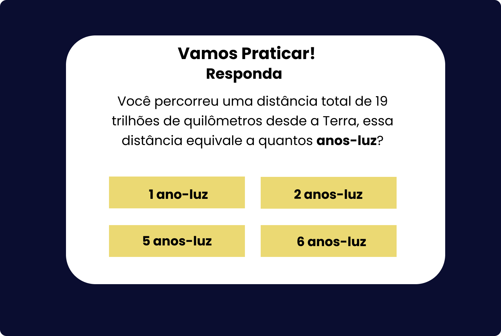<br>
 <sub>Fonte: Material produzido pelos autores (2026)</sub><br><br>
</div>

Em sua primeira versão, esta concepção visual apresenta as perguntas abordadas na dinâmica “Chuva de asteróides”. O design segue o princípio de baixo ruído visual e alta legibilidade, com pouco texto para que o usuário não se canse, garantindo que a obtenção de conhecimento seja interativa e objetiva.


### 3.3.5. Trilha sonora

Nosso jogo não possuirá áudios como trilha sonora, visando em deixar a jogatina mais simples e fluida. Em compensação, adicionamos áudios nas partes de explicação e diálogo, pensando em dar opções ao jogador de como ele gostará de aprender o conteúdo que está sendo ensinado.


\# | titulo | ocorrência | autoria
--- | --- | --- | ---
1 | Comecar_instrucao | Início do jogo na Terra | Própria com uso da IA ElevenLabs
2 | Introducao_astrofisica | Apresentação da NPC para o astronauta |Própria com uso da IA ElevenLabs
3 | Primeira_instrucao | Primeiros ensinamentos (serão usados na fase das cartas) | Própria com uso da IA ElevenLabs
4 | Audio_Telescopio | Ensinamentos dados antes da fase do telescópio |Própria com uso da IA ElevenLabs
5 | Audio_Ua | Ensinamentos dados antes do jogador ir para o quiz | Própria com uso da IA ElevenLabs
6 | NBasalto | Estudo do Basalto em Marte (fase dos coletáveis) |Própria com uso da IA ElevenLabs
7 | NCinzaV | Estudo das Cinzas Vulcânicas em Marte (fase dos coletáveis) |Própria com uso da IA ElevenLabs
8 | NGás | Estudo da Molécula de Dióxido de Hidrogênio em Marte (fase dos coletáveis) |Própria com uso da IA ElevenLabs
9 | NGelo | Estudo do Gelo em Marte (fase dos coletáveis) |Própria com uso da IA ElevenLabs
10 | NPoeira | Estudo da Poeira em Marte (fase dos coletáveis) |Própria com uso da IA ElevenLabs
11 | NBasalto | Estudo da Rocha em Marte (fase dos coletáveis) |Própria com uso da IA ElevenLabs


## 3.4. Inventário e Bestiário

### 3.4.1. Inventário

No ASTRA não possuímos itens de inventário, nossa gameplay foca em quizes e minigames, sem a utilização de nenhum tipo de item que será reultilizado ou que possua alguma função na progressão do jogo.

### 3.4.2. Bestiário

#### Meteoro

Diversos meteoros aparecerão durante a gameplay em cenas de chuva de meteoros, como o tutorial, a cena entre a Terra e Marte e a cena final até o buraco negro. Inicialmente, na cena do tutorial, haverá apenas um aviso quando um meteoro colidir com a nave do personagem. Mas, nas próximas cenas, os asteroides carregarão consigo perguntas acerca da matéria, possibilitando uma validação do aprendizado e maior dificuldade, pois a colisão pode significar perder a fase.


## 3.5. Gameflow (Diagrama de cenas)

O diagrama de Gameflow apresenta como o jogo funciona desde o começo até as fases de desafio. Ele mostra a sequência das cenas, as decisões do jogador, as condições de avanço e as situações de erro. Além disso, representa as classes, atributos e métodos utilizados, evidenciando a estrutura técnica do projeto.


Para conseguir visualizar a imagem completa, de forma detalhada, vá em: Documentos -> other -> ASTRA - Diagrama de Cenas.svg

Ou acesse o link: https://www.canva.com/design/DAHDwacQP20/1oafapPskrevAhTyo5Q0kQ/view?utm_content=DAHDwacQP20&utm_campaign=designshare&utm_medium=link2&utm_source=uniquelinks&utlId=h173afe22a6


## 3.6. Regras do jogo

#### Objetivo geral do jogo
O jogador assume o papel de um explorador espacial que deve viajar pelo Sistema Solar aprendendo conceitos de física e astronomia. A vitória ocorre ao completar todas as fases, respondendo corretamente às perguntas ao longo do percurso.

#### Regras de progressão
1. O jogador deve selecionar o planeta Terra na tela do Sistema Solar para iniciar a jornada.
2. O jogo avança em ciclos: exploração de planeta → viagem com chuva de meteoros → próximo planeta.
3. O jogador só avança para a próxima fase ao concluir todos os desafios obrigatórios da fase atual.
4. Caso o jogador perca todas as vidas em uma fase, a fase atual é reiniciada do início.

### Regras da Chuva de Meteoros
 
5. A nave se move continuamente pela tela, acompanhando a posição do cursor (mouse nos testes / olhar com o Eyetracker).
6. Meteoros surgem pela borda direita da tela em alturas e velocidades variadas, movendo-se em direção à esquerda.
7. No Tutorial: a colisão com um meteoro exibe apenas um modal de aviso "Cuidado!" orientando o jogador a desviar. Não há perguntas nem perda de vida nessa fase.
8. Nas fases seguintes: ao colidir com um meteoro, o jogo pausa e exibe um modal com uma pergunta sobre o conteúdo da fase anterior.
   - Resposta correta: o jogador não perde vida e o jogo retoma normalmente.
   - Resposta incorreta: o jogador perde 1 vida. E fecha automaticamente
9. O jogador começa cada fase com 3 vidas.
10. Ao perder todas as 3 vidas, uma tela de Game Over é exibida reiniciando a fase.

### Regras da Linha do Tempo Estelar (Drag and Drop)
 
11. A atividade apresenta um conjunto de cartas com eventos astronômicos (ex: "Big Bang", "Formação do Sistema Solar", "Origem da Vida").
12. O jogador clica em uma carta para selecioná-la. A carta passa a seguir o movimento do cursor (ou do olhar, com o Eyetracker). O jogador então clica na posição desejada na linha do tempo para soltá-la.
13. Cartas posicionadas incorretamente são sinalizadas com feedback visual e devem ser reposicionadas.
14. A atividade é concluída quando todas as cartas estiverem na ordem cronológica correta.

### Regras do Simulador de Telescópio
 
15. O jogador pode focar o cursor (ou o olhar) em elementos celestes exibidos na tela: nebulosa, galáxia e buraco negro.
16. Ao focar em um elemento, ele é ampliado automaticamente e informações sobre ele são exibidas ao lado.
17. O jogador deve explorar todos os elementos para liberar o avanço da fase.

### Proibições
18. O jogador não deve colidir desnecessariamente com meteoros nas fases de quiz, pois cada colisão com resposta incorreta resulta em perda de vida.
19. O jogador não pode avançar de fase sem concluir todos os desafios obrigatórios da fase atual.

## 3.7. Mecânicas do jogo

## Controles e Ações

> **Nota sobre os controles:** O jogo foi projetado para ser operado via cursor, de modo que os eventos do mouse são mapeados diretamente para o Eyetracker. Nos testes realizados até o momento, a interação foi simulada com o mouse. As descrições abaixo refletem o comportamento final esperado com o Eyetracker, e o mesmo comportamento é reproduzido pelo mouse durante os testes.
 
| Comando (Eyetracker) | Equivalente nos testes (Mouse) | Ação | Descrição |
|---|---|---|---|
| Direcionar o olhar para a esquerda | Mover o cursor para a esquerda | Movimentação | A nave se desloca para a esquerda acompanhando a posição do cursor. |
| Direcionar o olhar para a direita | Mover o cursor para a direita | Movimentação | A nave se desloca para a direita acompanhando a posição do cursor. |
| Direcionar o olhar para cima | Mover o cursor para cima | Movimentação | A nave se desloca para a parte superior da tela. |
| Direcionar o olhar para baixo | Mover o cursor para baixo | Movimentação | A nave se desloca para a parte inferior da tela. |
| Fixar o olhar no botão | Clicar no botão | Seleção | Inicia, continua ou reinicia o jogo. |
| Fixar o olhar em uma alternativa do quiz | Clicar na alternativa | Escolha de resposta | Seleciona a alternativa do quiz para envio. |
| Fixar o olhar na cientista e confirmar | Clicar na personagem | Movimentação | O astronauta se desloca em direção à NPC astrofísica. |
| Clicar em uma carta e clicar no destino | Clicar em uma carta e clicar no destino | Ordenação de cartas | O jogador clica em uma carta de evento (ex: "Big Bang", "Origem da Vida") para selecioná-la. A carta passa a seguir o movimento do cursor (ou do olhar, com o Eyetracker). Em seguida, o jogador clica na posição desejada na linha do tempo para soltá-la. |
 
---
 
## Combinações de Comandos
 
| Combinação (Eyetracker) | Equivalente nos testes (Mouse) | Ação | Descrição |
|---|---|---|---|
| Direcionar o olhar na diagonal | Mover o cursor na diagonal | Movimentação diagonal | O jogador navega em direções diagonais combinando os eixos horizontal e vertical simultaneamente. |
 
 
---
 
## Ações Consequentes
 
| Ação | Resultado | Descrição |
|---|---|---|
| Movimentação vertical | Deslocamento pela fase | A nave percorre o cenário e interage com os meteoros verticalmente. |
| Movimentação horizontal | Deslocamento pela fase | A nave percorre o cenário e interage com os meteoros horizontalmente. |
| Escolha correta após a colisão | Continuação do jogo | O jogador avança normalmente na fase. |
| Escolha incorreta após a colisão | Perda de vida | O jogador precisa continuar com mais atenção. |
| Perder todas as vidas | Game Over | O jogo exibe uma tela, dando a opção de reiniciar. |
| Concluir a leitura das informações de um corpo celeste no telescópio | Recebimento de broche | Ao terminar de ler as informações de um corpo celeste (nebulosa, galáxia ou buraco negro), o jogador recebe um broche referente àquele elemento como recompensa. |
## 3.8. Implementação Matemática de Animação/Movimento


## 3.8 Modelagem Matemática — Movimento do Meteoro

Buscando maior fluidez e dinamicidade no mini game de Chuva de Meteoros, implementamos um movimento com cálculo cinemático nos asteroides. A movimentação bidimensional do meteoro foi implementada com base nos conceitos de Movimento Uniforme (MU) e Movimento Uniformemente Variado (MUV), aplicados de forma independente em cada eixo. O eixo X adota o modelo MU, em que o meteoro percorre a tela com velocidade constante, e o eixo Y adota o modelo MUV, em que o meteoro parte do repouso e acelera progressivamente em direção à posição final. A implementação está no arquivo `meteoro.js`, nas funções `lancar()` e `atualizar()`.

### 3.8.1 Parâmetros do Modelo

Os parâmetros de entrada do modelo são os seguintes:

| Parâmetro | Variável no Código | Descrição |
| :--- | :--- | :--- |
| Posição inicial ($x_i, y_i$) | `xi`, `yi` | Ponto de origem do meteoro: borda direita da tela, altura aleatória |
| Posição final ($x_f, y_f$) | `xf`, `yf` | Ponto de destino: posição horizontal fixa em `100px`, altura aleatória |
| Duração total ($T$) | `this.T` | Tempo total da animação em segundos |
| Tempo decorrido ($t$) | `dados.tempoDecorrido` | Tempo acumulado a cada quadro (frame) via `delta / 1000` |

### 3.8.2 Decomposição dos Eixos

Para que o meteoro se mova em duas dimensões simultaneamente, o movimento é decomposto em dois eixos independentes, cada um seguindo um modelo cinemático diferente. Essa separação é baseada no princípio da independência dos movimentos, que afirma que o que acontece no eixo X não interfere no eixo Y e vice-versa (HALLIDAY; RESNICK; WALKER, 2023, p. 13).

O eixo X segue o modelo MU: o meteoro percorre a distância entre $x_i$ e $x_f$ com velocidade constante ao longo do tempo $T$, garantindo uma chegada previsível ao ponto de destino.

O eixo Y segue o modelo MUV: o meteoro parte do repouso ($v_{0y} = 0$) e é acelerado uniformemente em direção a $y_f$, chegando exatamente nessa posição ao final do tempo $T$. Isso cria um efeito de curvatura na trajetória, tornando o desvio mais desafiador.

### 3.8.3 Movimento Uniforme — Eixo X

O movimento no eixo X é uniforme porque a velocidade é constante ao longo de toda a trajetória. O meteoro percorre a distância entre $x_i$ e $x_f$ em exatamente $T$ segundos.

**a. Velocidade**

A velocidade no eixo X é calculada a partir dos parâmetros de posição e da duração total:

$$v_x = \frac{x_f - x_i}{T}$$

*encontrado na linha 17 em meteoro.js*
```javascript
const velocidadeX = (xf - xi) / this.T;
```

**b. Coordenada**

A posição no eixo X é atualizada somando a velocidade constante a cada quadro, reproduzindo a equação horária do MU $x(t) = x_i + v_x \cdot t$:

$$x_{n+1} = x_n + v_x \cdot \Delta t$$

*encontrado na linha 41 em meteoro.js*
```javascript
elemento.x += dados.velocidadeX * deltaSegundos;
```

### 3.8.4 Movimento Uniformemente Variado — Eixo Y

O movimento no eixo Y é uniformemente variado porque o meteoro parte do repouso ($v_{0y} = 0$) e a aceleração é constante ao longo do tempo, fazendo com que ele chegue exatamente em $y_f$ ao final de $T$ segundos.

**a. Aceleração**

A aceleração é calculada a partir dos parâmetros de posição e da duração total, a partir da equação horária do MUV com velocidade inicial nula $\left(y_f = y_i + \frac{1}{2}a_y \cdot T^2\right)$:

$$a_y = \frac{2(y_f - y_i)}{T^2}$$

*encontrado na linha 18 em meteoro.js*
```javascript
const aceleracaoY = 2 * (yf - yi) / (this.T * this.T);
```

**b. Velocidade**

A velocidade vertical cresce linearmente com o tempo a partir do repouso ($v_{0y} = 0$), seguindo a função horária do MUV:

$$v_y(t) = v_{0y} + a_y \cdot t = a_y \cdot t$$

A cada quadro isso é calculado a partir do estado anterior:

$$v_{y_{n+1}} = v_{y_n} + a_y \cdot \Delta t$$

*encontrado na linha 42 em meteoro.js*
```javascript
dados.velocidadeY += dados.aceleracaoY * deltaSegundos;
```

**c. Coordenada**

A posição no eixo Y é atualizada somando a velocidade atual a cada quadro, equivalente à equação horária contínua $y(t) = y_i + \frac{1}{2}a_y \cdot t^2$:

$$y_{n+1} = y_n + v_{y_n} \cdot \Delta t$$

*encontrado na linha 43 em meteoro.js*
```javascript
elemento.y += dados.velocidadeY * deltaSegundos;
```


### 3.8.5 Síntese das Funções Matemáticas

A tabela abaixo reúne todas as funções matemáticas do modelo nos dois eixos:

| Grandeza | Eixo X (MU) | Eixo Y (MUV) |
| :--- | :--- | :--- |
| Velocidade inicial | $v_x = \dfrac{x_f - x_i}{T}$ | $v_{0y} = 0$ |
| Aceleração | $a_x = 0$ | $a_y = \dfrac{2(y_f - y_i)}{T^2}$ |
| Velocidade em $t$ | $v_x(t) = v_x$ | $v_y(t) = a_y \cdot t$ |
| Posição em $t$ | $x(t) = x_i + v_x \cdot t$ | $y(t) = y_i + \dfrac{1}{2}a_y \cdot t^2$ |

### 3.8.6 Localização no Código

A função `lancar()` está localizada da linha 9 até a 26 do arquivo `src/components/meteoro.js` é responsável por sortear as posições iniciais e finais do meteoro e calcular `velocidadeX` e `aceleracaoY` diretamente a partir de `(xi, xf, T)` e `(yi, yf, T)`, inicializando também `velocidadeY: 0` para o ponto de partida do repouso. A função `atualizar(delta)`, localizada da linha 28 até a 48 do arquivo `src/components/meteoro.js`, é chamada a cada quadro pelo método `update()` da cena e realiza as atualizações iterativas de velocidade e posição em ambos os eixos. O movimento é encerrado quando `tempoDecorrido >= T`, garantindo que o meteoro percorra exatamente a trajetória calculada.

### 3.8.7 Referências

HALLIDAY, David; RESNICK, Robert; WALKER, Jearl. **Fundamentos de Física — Mecânica — Volume 1**. 12. ed. Rio de Janeiro: LTC, 2023. p. 13. ISBN 9788521638551. Disponível em: https://integrada.minhabiblioteca.com.br/reader/books/9788521638551/. Acesso em: 19 mar. 2026.19 mar. 2026.# 


## 4. Desenvolvimento do Jogo

### 4.1. Desenvolvimento preliminar do jogo
*A primeira Sprint teve como foco principal o desenvolvimento dos elementos essenciais para a estrutura básica do projeto, incluindo a definição do conceito inicial, a criação do primeiro cenário (Sistema Solar), a implementação do modal de boas-vindas e o desenvolvimento da primeira mecânica baseada em Eye Tracker, que atualmente está sendo simulado pelo movimento do mouse. O grupo selecionou os seguintes requisitos para implementarmos durante a Sprint 1.*

### Esboço da Narrativa

A equipe utilizou o brainstorming para definir a abordagem do tema "Origem do Universo", avaliando iniciar pelo Big Bang, pela formação das galáxias ou pelo Sistema Solar. Sendo assim, foi optado pelo Sistema Solar por ser mais didático e visualmente acessível. O jogo começa com um modal de boas-vindas, que apresenta a proposta e explica a interação por meio do olhar. Em seguida, o jogador observa a Terra para avançar, e uma nova tela é exibida, introduzindo a mecânica de desviar de meteoros. Essa sequência estabelece a base para as primeiras semanas de desenvolvimento do projeto.

### Personagem

O jogo foi desenvolvido com foco em acessibilidade, utilizando um foguete como personagem principal. A proposta central é que o direcionamento do foguete seja realizado por meio da tecnologia de Eye Tracker, utilizando apenas o olhar. Essa mecânica torna a experiência mais imersiva e inclusiva, especialmente por estar voltada a pessoas com multideficiências ou visão reduzida.

### Cenário

O cenário inicia-se ao redor dos planetas, em razão da escolha do tema do jogo, "Origem do Universo", o qual está diretamente relacionado ao espaço. Nesse ambiente, cada planeta apresenta cores distintas, evidenciando suas características específicas.

Com base nas aulas ministradas e nas discussões realizadas com os professores, o jogo foi desenvolvido por meio de desenhos feitos à mão. A etapa mais desafiadora do processo consistiu na definição e aplicação das cores e dos contrastes.

<div align="center">
 Figura 35: Tela inicial do jogo apresentando o Sistema Solar com modal de boas-vindas<br><br>
 <br>
 <sub>Fonte: Material produzido pelos autores (2026)</sub><br><br>
</div>

### Movimentação

O jogo inicia-se com a seleção da Terra pelo jogador. Após essa etapa, uma nova tela é apresentada, marcando o início da introdução às mecânicas de deslocamento. A partir desse momento, a aeronave passa a se movimentar pelo cenário de acordo com o direcionamento vertical — para cima e para baixo — realizado pelo jogador por meio do dispositivo Eye Tracker.

<div align="center">
 Figura 36: Mecânica de navegação com o foguete desviando de asteroides controlado por Eye Tracker.<br><br>
 <br>
 <sub>Fonte: Material produzido pelos autores (2026)</sub><br><br>
</div>

**Exemplo de código da implementação:**

A aplicação foi desenvolvida com a biblioteca Phaser, utilizando as funções preload, create e update. Preload carrega os recursos gráficos, create inicializa a nave, o grupo de meteoros e os temporizadores de geração de meteoros e término da fase, e update atualiza continuamente a posição da nave conforme o cursor, removendo meteoros fora da tela. A função lancarMeteoro cria meteoros em posições aleatórias, com movimento e rotação simulando o dinamismo no espaço.

A seguir, é apresentado o código principal: 
```javascript
var game = new Phaser.Game(config);

function preload() {
    this.load.image('nave', 'style/assets/nave.png');
    this.load.image('meteoro', 'style/assets/meteoro.png');
}

function create() {
    // posiciona a nave à esquerda, centralizada na vertical 
    nave = this.physics.add.image(150, 300, 'nave');
    nave.setScale(0.18); 
    nave.setCollideWorldBounds(true);
    nave.setVisible(false); // Fica invisível até o modal fechar

    // grupo para os meteoros
    meteoros = this.physics.add.group();

    // função chamada pelo botão do modal no html
    this.comecarJogo = function() {
        if (!jogoAtivo) {
            jogoAtivo = true;
            
            // define a posição inicial da nave
            nave.setPosition(150, 300);
            nave.setVisible(true);

            // Cria meteoros a cada 1 segundo e meio
            cronometroMeteoros = this.time.addEvent({
                delay: 1500,
                callback: lancarMeteoro,
                callbackScope: this,
                loop: true
            });

            cronometroFinal = this.time.delayedCall(20000, function() {
                window.location.href = "chegada_terra.html"; 
            }, [], this);
        }
    };

}

function update() {
    if (jogoAtivo) {
        // a nave segue o mouse 
        // 0.1 define a velocidade de acompanhamento 
        nave.x = Phaser.Math.Linear(nave.x, this.input.x, 0.1);
        nave.y = Phaser.Math.Linear(nave.y, this.input.y, 0.1);

        // Destrói meteoros que saem da tela à esquerda
        meteoros.getChildren().forEach(meteoro => {
            if (meteoro.x < -100) {
                meteoro.destroy();
            }
        });
    }
}

function lancarMeteoro() {
    // nascem fora da tela à direita, em uma altura Y aleatória
    var yAleatorio = Phaser.Math.Between(50, 550);
    var meteoro = meteoros.create(1100, yAleatorio, 'meteoro');
    meteoro.setScale(0.2); 

    // Movimento constante da direita para a esquerda
    // Velocidade negativa no eixo X faz com que ele vá para a esquerda
    var velocidadeX = Phaser.Math.Between(-200, -400);
    meteoro.setVelocityX(velocidadeX);

    // Adiciona uma rotação aleatória para parecer uma pedra no espaço
    meteoro.setAngularVelocity(Phaser.Math.Between(-150, 150));
}
```

### Interação com o Cenário

O jogo também contará com interação dinâmica com o cenário, reforçando a proposta divertida e acessível. Ao direcionar o olhar para um planeta específico (atualmente simulado pelo movimento do mouse), o sistema reconhecerá o ponto de foco e ativará uma resposta visual imediata. O planeta observado será expandido suavemente na tela, destacando-se dos demais elementos do cenário.

<div align="center">
 Figura 37: Modal de boas-vindas com instrução: "Olhe para nosso planeta Terra e aprenda todas as maravilhas do Universo.<br><br>
 <br>
 <sub>Fonte: Material produzido pelos autores (2026)</sub><br><br>
</div>

### Design dos Minigames

Dentre os minigames implementados, utilizamos a mecânica da navegação, com o foguete sendo guiado pela movimentação do olho com o Eye Tracker entre os asteroides, e, caso ocorra uma colisão, aparecerá um pop-up com um quiz baseado na experiência do jogador até agora.

<div align="center">
 Figura 38: Minigame de navegação entre asteroides.<br><br>
 <br>
 <sub>Fonte: Material produzido pelos autores (2026)</sub><br><br>
</div>

A seguir, a Figura 39 ilustra a tela que apresentará a pergunta a ser respondida com a seleção de uma das alternativas.

<div align="center">
 Figura 39: Exemplo de quiz que aparecerá após colisão.<br><br>
 <br>
 <sub>Fonte: Material produzido pelos autores (2026)</sub><br><br>
</div>

### Dificuldades e Próximos Passos

**Dificuldades encontradas:**
- Definição adequada de cores e contrastes para acessibilidade
- Integração da tecnologia Eye Tracker com a mecânica do jogo
- Balanceamento da dificuldade do minigame de desvio de asteroides

**Próximos passos:**
- Refinamento da calibração do Eye Tracker
- Expansão do conteúdo educativo com mais quizzes
- Desenvolvimento de novos cenários além do Sistema Solar
- Testes de usabilidade com o público-alvo

## 4.2. Desenvolvimento básico do jogo
A segunda sprint teve como foco principal evoluir e aperfeiçoar os elementos desenvolvidos na etapa anterior. Entre as principais melhorias, destacam-se a criação da tela com quizes, o desenvolvimento de um novo cenário e a otimização dos cenários já existentes, além da implementação de uma nova narração e do aprimoramento das mecânicas do jogo. As atualizações realizadas estão descritas a seguir:

#### Narrativa  

Na primeira sprint, a narrativa principal foi definida: "O jogo se inicia com a visualização do Sistema Solar, destacando o Sol e os planetas mais próximos. O jogador assume o papel de um explorador espacial que deve viajar entre diferentes corpos celestes para expandir seus conhecimentos em astronomia. Durante as viagens, ele enfrenta desafios no espaço, como chuvas de meteoros, que testam seus conhecimentos por meio de perguntas acadêmicas. Ao chegar aos planetas, novas atividades educativas são desbloqueadas, permitindo aprofundar o aprendizado sobre cada objeto astronômico." Com essa premissa, a mecânica do jogo foi estruturada em ciclos de exploração e desafio, nos quais cada interação contribui para a consolidação dos conteúdos estudados em sala de aula.

Com a narrativa estabelecida, a equipe voltou seu foco, na segunda sprint, para a experiência inicial do jogador, desenvolvendo uma introdução interativa ao Sistema Solar. O objetivo era criar uma transição mais fluida entre a apresentação dos conteúdos e a jogabilidade, tornando a progressão mais natural e intuitiva.

A cena inicial apresenta a visão do Sistema Solar, permitindo que o jogador foque em planetas como Mercúrio, Vênus e Terra para visualizar informações como distância em unidades astronômicas (UA), composição atmosférica e características principais. Ao selecionar a Terra, inicia-se um tutorial em formato de viagem espacial. Nesse momento, o jogador aprende a controlar a nave por meio do movimento dos olhos, com auxílio do eye tracker, enquanto enfrenta uma chuva de asteroides. Ao colidir com um meteoro, aparece um aviso de "cuidado", incentivando o jogador a desviar dos obstáculos e reforçando a atenção durante a navegação pelo espaço.

Ao chegar à Terra, a transição visual se torna um elemento importante da experiência. O pouso do foguete é apresentado em terceira pessoa, permitindo que o jogador visualize o personagem saindo da nave e caminhando em direção ao astronauta, ampliando a percepção do ambiente e reforçando a sensação de conquista após a viagem espacial. No momento da interação com o astronauta, a câmera muda para a primeira pessoa, aumentando a imersão e colocando o jogador como protagonista direto do diálogo e das atividades propostas.

Dentro desse ambiente inspirado em instalações espaciais, são introduzidas atividades como a construção de uma linha do tempo estelar, o uso de um simulador de telescópio e a exploração de escalas astronômicas. Concluída essa introdução, o ciclo principal do jogo é estabelecido: após cada exploração, o jogador parte em direção ao próximo corpo celeste, enfrentando novos desafios no trajeto e reforçando o conhecimento adquirido anteriormente.

Esse refinamento no início do jogo tornou a experiência mais envolvente e organizada, garantindo que o jogador compreenda tanto a proposta educativa quanto a mecânica antes de avançar para desafios mais complexos.

#### Tela Inicial

Considerando que o jogo é destinado a alunos do primeiro ano do ensino médio, a interface da tela inicial foi pensada com foco em minimalismo e acessibilidade. Essa escolha não se deu apenas por questões estéticas, mas principalmente para atender pessoas com baixa visão e adolescentes com deficiências motoras, que utilizarão o eye tracker como principal forma de interação.

O uso de poucos elementos na tela reduz a poluição visual e facilita a identificação das informações principais. O fundo em tom escuro cria um ambiente visualmente confortável, enquanto o alto contraste com elementos claros — como o card central e o botão em amarelo — garante melhor legibilidade. As fontes são grandes, objetivas e centralizadas, favorecendo a leitura rápida e precisa.

O botão foi mantido em destaque no centro da tela, com tamanho ampliado e bordas arredondadas, facilitando sua visualização e identificação. Além disso, a organização centralizada dos elementos contribui para uma navegação mais intuitiva e confortável, especialmente para usuários que utilizam tecnologias assistivas.

<div align="center">
 Figura 40: Tela inicial<br><br>
 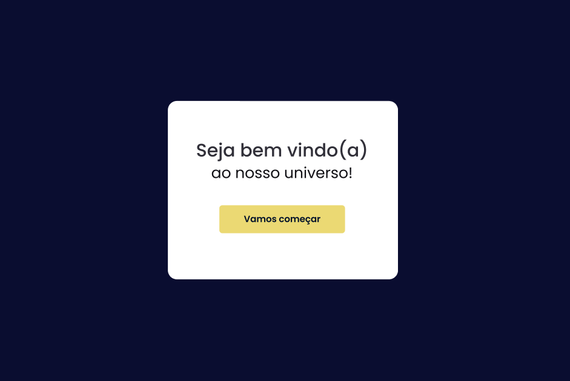<br>
 <sub>Fonte: Material produzido pelos autores (2026)</sub><br><br>
</div>

#### Funcionamento dos botões da tela inicial 

O botão foi centralizado na tela, acompanhando o layout minimalista da interface. Para reforçar sua interatividade, foi aplicado um leve efeito de aumento ao passar o cursor sobre ele, criando um pequeno "zoom" que destaca o elemento de forma sutil e intuitiva.

Ao ser acionado, o botão direciona o jogador para a fase de mini tutorial do jogo, onde se inicia a primeira etapa da experiência e a ambientação inicial.

#### Design e Cenário

O cenário apresentado representa o Sistema Solar em um ambiente digital minimalista, desenvolvido com formas simples e cores sólidas para facilitar a visualização. Optou-se por um estilo limpo e moderno, com fundo azul-escuro simulando o espaço, criando contraste e conforto visual.

Os planetas foram ilustrados com cores bem definidas e traços marcantes: o Sol, em amarelo intenso, ocupa posição de destaque à esquerda, enquanto os demais planetas estão distribuídos de forma equilibrada pelo cenário, incluindo a Terra em evidência. As texturas foram simplificadas, utilizando padrões suaves que diferenciam cada planeta sem sobrecarregar a tela.

No canto superior, foi inserido um balão de orientação com instruções iniciais, guiando o estudante na interação com o conteúdo. Já no canto inferior esquerdo, foram adicionados ícones de controle de som, mantendo a organização e a clareza visual.

A escolha pelo design minimalista garante melhor legibilidade, alto contraste e menor poluição visual, tornando o cenário mais acessível para pessoas com baixa visão e adequado para interação por eye tracker. O resultado é um ambiente educativo, organizado e visualmente equilibrado, alinhado à proposta pedagógica.

<div align="center">
Figura 41: Tela do sistema solar<br><br>
 <br>
 <sub>Fonte: Material produzido pelos autores (2026)</sub><br><br>
</div>

<div align="center">
Figura 42: Tela dos Asteroides<br><br>
 <br>
 <sub>Fonte: Material produzido pelos autores (2026)</sub><br><br>
</div>

<div align="center">
Figura 43: Tela de perguntas<br><br>
 <br>
 <sub>Fonte: Material produzido pelos autores (2026)</sub><br><br>
</div>

#### Trilha Sonora

Na sprint anterior, foi cogitada a inclusão de recursos sonoros para ampliar a imersão do jogador. No entanto, nesta versão do jogo, esses elementos ainda não foram implementados.

A proposta inicial previa o uso de narração opcional para explicar conceitos astronômicos e orientar o jogador durante as viagens e atividades educativas, além da utilização de efeitos sonoros para reforçar a ambientação espacial, como alertas durante a chuva de meteoros e sons relacionados à navegação da nave.

Apesar dessas ideias terem sido discutidas no planejamento do projeto, nenhum recurso de áudio — como narração, trilha sonora ou efeitos sonoros — foi implementado até o momento. Esses elementos permanecem como possibilidades para desenvolvimentos futuros do jogo.


## 4.3. Desenvolvimento intermediário do jogo
#### O que foi desenvolvido (código e jogo):

A terceira sprint teve como objetivo implementar algumas melhorias no jogo para deixar a experiência do jogador melhor e organizar o funcionamento das fases. Nessa etapa, o foco principal foi melhorar algumas telas do jogo, ajustar as transições entre cenas e criar novos jogadores com elementos do cenário. Também foram feitos alguns ajustes no código para melhorar o funcionamento do jogo e facilitar a criação das próximas fases.

Durante a quarta sprint, desenvolvemos toda a dinâmica que será realizada no segundo planeta do jogo, ou seja, em Marte. Serão seis cenas presenciadas pelo jogador, sendo que quatro serão jogáveis (escolha do lugar, coleta de recursos, junção de recursos e saída do buraco negro). Essas duas semanas foram de grande importância para nosso projeto, pois foram nelas que conseguimos desenvolver a segunda parte do jogo e o final, que poderá ser expandido futuramente. Além dessas novas fases, também aplicamos um sistema de som para nosso jogo, que tornará ele muito mais acessível, facilitando no compreendimento de cenas com diálogos maiores.

#### Interface e Navegação do Jogo:

Foram adicionadas novas cenas, enriquecendo a experiência do jogador e tornando a progressão entre as fases mais clara e intuitiva.

Além disso, novos personagens foram incorporados, assim como suas interações com elementos do cenário. Ajustes na organização do código também foram realizados, facilitando o gerenciamento das cenas e das mecânicas do jogo nas próximas etapas do desenvolvimento.

#### Sistema de vidas

Adicionamos um sistema de vidas que servirá para as partes que envolvem o quiz. Nessas fases, será necessário responder uma pergunta, sendo que haverá apenas quatro opções disponíveis, com apenas uma correta. Após a escolha ser feita, o jogador receberá um feedback e, caso seja negativo, ele perderá uma de suas três vidas. Após a perda de todas, uma tela de Game Over será mostrada e será necessário o reinício da cena, até que o jogador consiga avançar com no mínimo uma vida.

#### Ilustrações (Capturas de tela):

<div align="center">
Figura 44: Tela dos Meteoros<br><br>
 <br>
 <sub>Fonte: Material produzido pelos autores (2026)</sub><br><br>
</div>

Fizemos pequenos ajustes na fase dos asteroides (src/cenas/ChuvaMeteoros.js), pois o código apresentou um pequeno conflito que fazia aparecer dois asteroides e duas perguntas ao mesmo tempo, o que acabava gerando certo desconforto para o usuário durante a jogabilidade. Assim, realizamos correções para garantir que os elementos apareçam de forma organizada, melhorando a experiência do jogador.

<div align="center">
Figura 45: Personagens<br><br>
 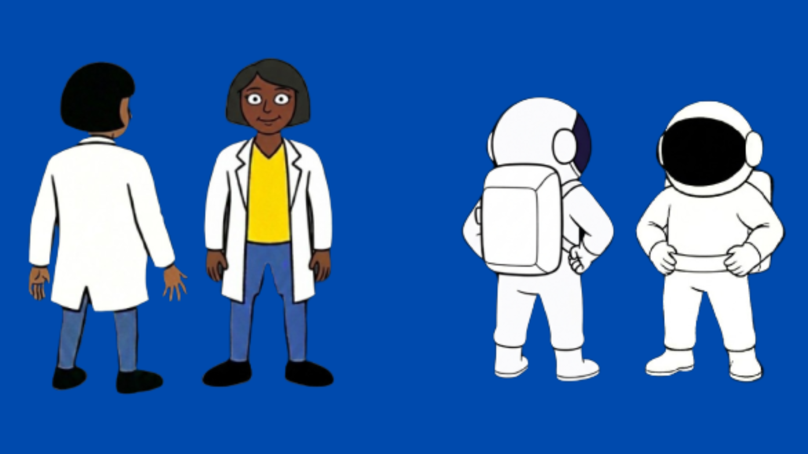<br>
 <sub>Fonte: Material produzido pelos autores (2026)</sub><br><br>
</div>

Pensando na jogabilidade, descartamos a ideia inicial de ter quatro personagens jogáveis e optamos por manter apenas um personagem: o astronauta, que vai representar todos os jogadores durante a experiência.

Já o personagem guia, à esquerda da imagem, foi desenvolvido com inspiração na representatividade. A referência veio da história retratada no filme Estrelas Além do Tempo, que mostra a trajetória de superação de cientistas negras na NASA. Em especial, nos inspiramos em Dorothy Vaughan (1910–2008), matemática e "computador humano" essencial para a NASA, cuja história de inteligência, persistência e contribuição científica motivou a criação desse personagem orientador no jogo.

<div align="center">
Figura 46: Chegada a terra<br><br>
 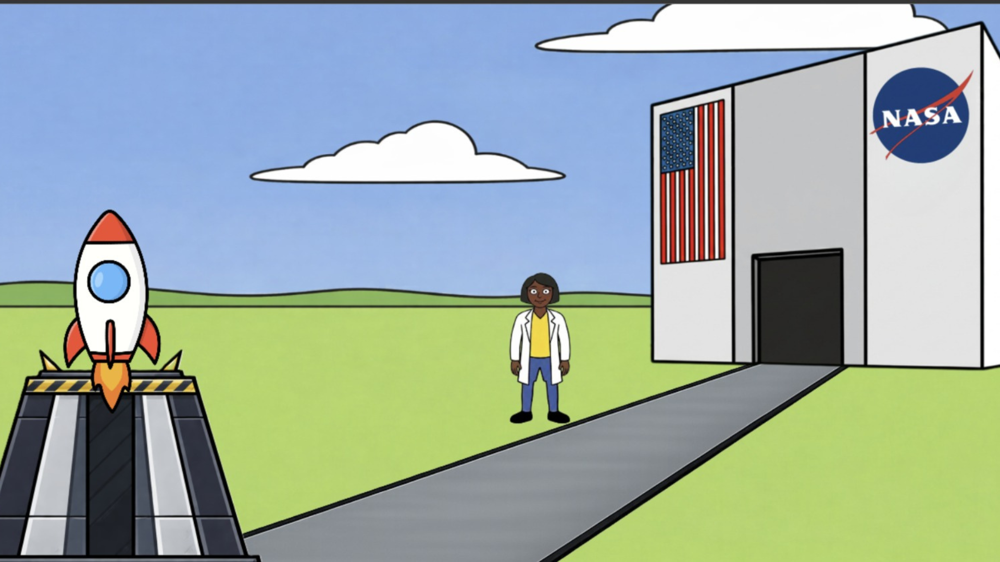<br>
 <sub>Fonte: Material produzido pelos autores (2026)</sub><br><br>
</div>

Foi adicionada uma nova cena mostrando a chegada à Terra, na qual o jogador visualiza a nave e a astrofísica que atuará como guia. Essa inclusão enriquece a experiência do jogador e facilita a compreensão da progressão entre as fases.

<div align="center">
Figura 47: Construção da linha do tempo<br><br>
 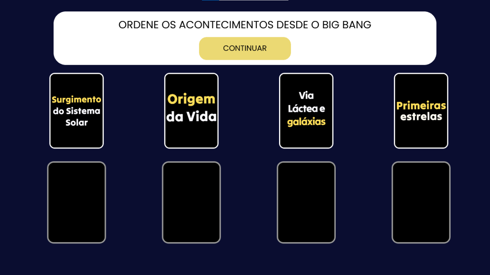<br>
 <sub>Fonte: Material produzido pelos autores (2026)</sub><br><br>
</div>

Uma nova cena foi adicionada, relacionada à dinâmica da linha do tempo estelar. Nessa cena, o jogador organiza cartas com palavras como "Big Bang", "Origem da Vida" e outros eventos, posicionando-as corretamente ao longo da linha do tempo. Essa atividade ajuda a compreender a sequência histórica do universo e reforça o aprendizado de forma interativa.

<div align="center">
Figura 48: Simulador do telescópio<br><br>
 <br>
 <sub>Fonte: Material produzido pelos autores (2026)</sub><br><br>
</div>

Foi adicionada uma nova cena com o telescópio, onde o jogador tem a sensação de observar o universo de forma imersiva. Na cena, são apresentados três elementos celestes: uma nebulosa, uma galáxia e um buraco negro.

Quando o jogador foca o olhar em um desses elementos, ele se expande, permitindo que seja visualizado com mais detalhes. Ao mesmo tempo, ao lado do elemento, aparecem informações relacionadas, como características da nebulosa, da galáxia ou do buraco negro. Dessa forma, o jogador consegue explorar e aprender sobre cada corpo celeste de maneira interativa e intuitiva, reforçando o conteúdo educativo do jogo.

<div align="center">
Figura 49: Saída da Terra<br><br>
 <br>
 <sub>Fonte: Material produzido pelos autores (2026)</sub><br><br>
</div>

Após a fase do telescópio, o jogador sairá da Terra e irá em direção a Marte. No processo, ele terá que desviar de meteoros, assim como tinha feito mais cedo, e caso acerte, ele terá que responder perguntas como a da imagem acima. Caso erre três vezes, uma tela de Game Over aparecerá, e ele terá que jogar a fase novamente.

#### Dificuldades encontradas:

Phaser: Uma das principais dificuldades foi estudar o framework Phaser e compreender suas mecânicas para conseguir implementar corretamente o código no jogo. Como a equipe ainda estava se familiarizando com a ferramenta, foi necessário dedicar tempo para entender sua estrutura, funcionamento das cenas, organização dos elementos e formas de interação dentro do jogo.

*Mecânica de click and drag*: Também tivemos dificuldades ao implementar a mecânica de *click and drag*. Precisamos modificar códigos já existentes do Phaser e adaptá-los pensando em acessibilidade, já que o jogo é voltado para pessoas com baixa visão. Por isso, foi necessário desenvolver uma mecânica própria que funcionasse de forma mais clara e intuitiva para o jogador.

Modal: A implementação do modal também apresentou desafios, principalmente para inserir elementos que fossem totalmente adaptáveis. Foi necessário estruturar corretamente títulos, descrições, alternativas e outros conteúdos dentro do modal, garantindo organização visual e boa legibilidade.

Animações: No início do desenvolvimento, a criação e implementação de animações também foi um ponto de dificuldade. Tivemos que estudar como funcionam as animações dentro do Phaser para conseguir aplicá-las corretamente nos elementos do jogo, contribuindo para uma experiência mais dinâmica e interativa.

#### Próximos passos:

Implementação da narração em todo o jogo: Inserir a narração ao longo de todas as fases para guiar o jogador e explicar os conceitos apresentados durante a experiência.

Desenvolvimento das cenas de Marte: Implementar as cenas planejadas, como a análise das regiões do planeta, o giro da nave, a aterrissagem e a exploração do ambiente marciano.

Sistema de interação com os elementos: Programar a interação com os objetos do cenário, permitindo que o jogador clique nos elementos para abrir modais com informações e coletar itens.

Ajustes e melhorias no código existente: Revisar e ajustar o código que já foi desenvolvido no jogo para garantir que as novas funcionalidades funcionem corretamente dentro da estrutura atual.

Implementação das perguntas finais: Desenvolver a etapa final do jogo com perguntas relacionadas ao conteúdo aprendido, oferecendo feedback para as respostas do jogador.

Melhorias na experiência do jogo: Adicionar ajustes visuais, animações e melhorias na navegação para tornar o jogo mais claro e imersivo para o jogador.

## 4.4. Desenvolvimento final do MVP

O Mínimo Produto Viável (MVP) consiste em uma versão simplificada do projeto, contendo apenas suas funcionalidades essenciais. Dessa forma, seu principal objetivo é validar o produto junto ao parceiro, promovendo o alinhamento das expectativas e verificando se as funcionalidades desenvolvidas atendem ao que foi proposto.

A implementação do MVP permite que a equipe de desenvolvimento dê continuidade às funcionalidades que estejam de acordo com as necessidades do parceiro. Caso necessário, também possibilita a reavaliação de decisões já tomadas, contribuindo para o redirecionamento do projeto conforme o escopo mais adequado. Além disso, a entrega do MVP auxilia na redução de custos de manutenção, ao evitar investimentos em funcionalidades que ainda não foram validadas.

Durante a Sprint 4, a equipe concentrou seus esforços na finalização do MVP. Foram realizados aprimoramentos na Fase da Terra, incluindo ajustes de design para melhor contraste, implementação de um sistema de leitura nos modais explicativos e melhorias de responsividade. Adicionalmente, novas cenas foram incorporadas ao jogo com a introdução da Fase Marte, contemplando telas de apresentação de conteúdo, maior imersão no cenário e dinâmicas voltadas à validação do conhecimento.

### Configurações gerais

Como configurações gerais do jogo, foi implementado o recurso de responsividade em todas as cenas, garantindo que não haja diferenças visuais entre diferentes tamanhos de tela ou monitor. Isso permitiu padronizar a experiência dos jogadores, independentemente do dispositivo utilizado.

Além disso, foi incorporada a fonte tipográfica Aphont, desenvolvida pela American Printing House for the Blind, com foco em legibilidade e acessibilidade para pessoas com baixa visão. A adoção dessa fonte, sugerida pelas parceiras do projeto, contribui para maior clareza e distinção entre os caracteres. A seguir, apresenta-se o código de aplicação:
```javascript
@font-face {
    font-family: 'APHONT';
    src: url('./assets/fonts/aphont.ttf');
}
```

Para reforçar a acessibilidade adaptativa, também foram implementadas configurações de tamanho de fonte, permitindo ao usuário escolher entre pequena, média e grande, sendo a opção média definida como padrão. A seguir, a Figura 50 apresenta o design do recurso de alteração.

<div align="center">
Figura 50: Configuração do tamanho da fonte<br><br>
 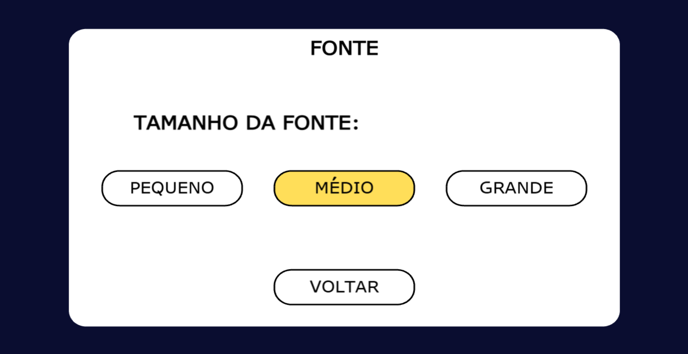<br>
 <sub>Fonte: Material produzido pelos autores (2026)</sub><br><br>
</div>

Adicionalmente, foram inseridos áudios explicativos como suporte à aprendizagem, oferecendo ao jogador a possibilidade de complementar a leitura com conteúdo sonoro. Esse recurso pode ser ativado ou desativado a qualquer momento no menu de configurações, como mostrado na Figura 51, conforme a necessidade do usuário.

<div align="center">
Figura 51: Configuração do som<br><br>
 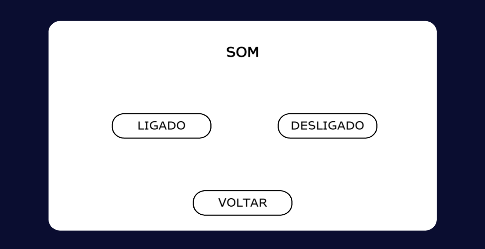<br>
 <sub>Fonte: Material produzido pelos autores (2026)</sub><br><br>
</div>

Outro recurso implementado foi o modo de tela cheia, que proporciona maior imersão ao eliminar distrações externas, como notificações ou outras abas do navegador, permitindo que o estudante foque exclusivamente no jogo. Este diferencial pode ser encontrado no menu de configurações, como mostrado na Figura 52 a seguir.

<div align="center">
Figura 52: Ativação do recurso de tela cheia<br><br>
 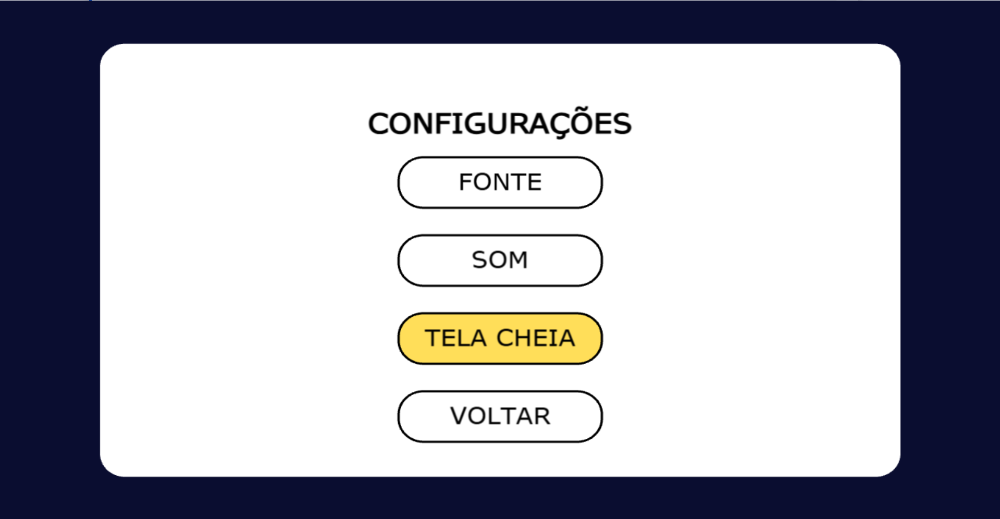<br>
 <sub>Fonte: Material produzido pelos autores (2026)</sub><br><br>
</div>

Por fim, como representado na Figura 53, foi adicionado um sistema de vidas às cenas de chuva de meteoros, integrado a perguntas sobre o conteúdo aprendido. Nessas situações, o jogador deve responder a uma questão com quatro alternativas, sendo apenas uma correta. Após a resposta, é fornecido um feedback imediato. Em caso de erro, o jogador perde uma vida, representada pelo coração. Ao esgotar todas as vidas, é exibida uma mensagem de "Tente novamente", redirecionando o jogador para reiniciar o desafio até conseguir avançar com pelo menos uma vida restante.

<div align="center">
Figura 53: Sistema de Vidas<br><br>
 <br>
 <sub>Fonte: Material produzido pelos autores (2026)</sub><br><br>
</div>

### Modelagem do Movimento dos Meteoros

Para tornar o jogo mais dinâmico e proporcionar uma experiência mais desafiadora ao jogador, foi implementado um modelo cinemático para a movimentação dos meteoros. Esse modelo conta com a implementação de um deslocamento que ocorre em dois eixos independentes: no eixo X, com velocidade constante (Movimento Uniforme), e no eixo Y, com aceleração progressiva (Movimento Uniformemente Variado). Sendo assim, essa combinação gera uma trajetória curva, tornando a movimentação mais natural e imprevisível durante o jogo. 

Para uma descrição mais detalhada do modelo e de sua implementação, consulte a Seção 3.8 deste documento.

### Fase Terra

No decorrer da Sprint 3, foram desenvolvidos os elementos visuais e a estrutura lógica de programação da fase na Terra. A partir dos feedbacks dos parceiros de projeto, foram identificados pontos de melhoria, como a necessidade de aumentar o contraste de cores e incorporar novas funcionalidades sugeridas pelos professores, que foram adicionados durante a Sprint 4.

Na Figura 54, observa-se o contraste inicial da interface, no qual o botão amarelo sobre o fundo branco apresentava baixa distinção visual, comprometendo a identificação e a compreensão do elemento.

<div align="center">
Figura 54: Botão com baixo contraste<br><br>
 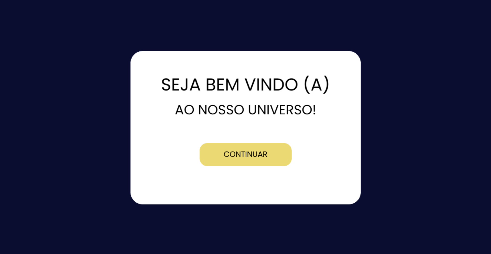<br>
 <sub>Fonte: Material produzido pelos autores (2026)</sub><br><br>
</div>

Diante disso, foi adicionada uma borda preta ao visual, aumentando significativamente o contraste e tornando-o mais perceptível. Essa adaptação contribui para a acessibilidade visual, atendendo melhor aos diferentes níveis de percepção do público-alvo. A melhoria pode ser visualizada na Figura 55 a seguir.

<div align="center">
Figura 55: Botão com alto contraste<br><br>
 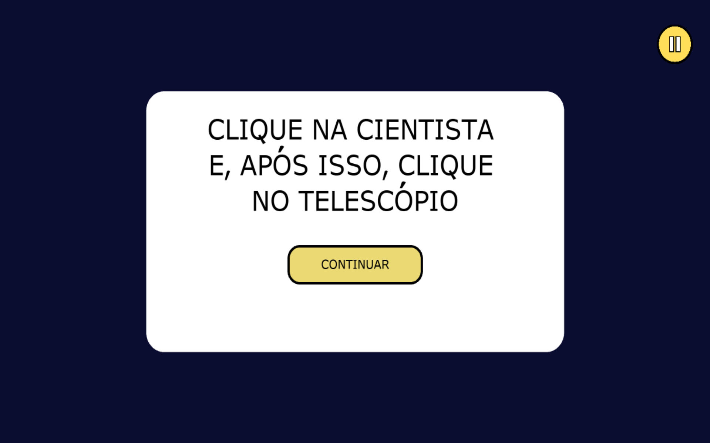<br>
 <sub>Fonte: Material produzido pelos autores (2026)</sub><br><br>
</div>

Esse ajuste exemplifica a aplicação do uso estratégico de contraste para destacar elementos interativos. Além dos botões, outros componentes também foram aprimorados com esse mesmo objetivo, como cenários e objetos coletáveis, reforçando a clareza visual em toda a experiência.

Além das melhorias visuais, a equipe buscou evoluir a experiência do usuário com a implementação de novas funcionalidades. Entre elas, destaca-se o sistema de leitura baseado no movimento dos olhos, que realiza a rolagem automática do texto conforme o jogador avança na leitura dentro do modal.

Diferentemente de um sistema tradicional de "slides", que exige cliques constantes para avançar ou retroceder, essa abordagem mantém o conteúdo em um único espaço contínuo. Isso permite que o jogador navegue pelo texto de forma mais fluida, podendo retomar informações com facilidade e sem interrupções, favorecendo uma compreensão mais eficiente do conteúdo apresentado.

### Fase Marte

Para ampliar a imersão do jogo Astra no contexto espacial, foi incorporada uma nova fase ambientada em Marte. Nessa etapa, o design foi construído com base em uma paleta de cores terrosas, reforçando a identidade visual do planeta. Também foram introduzidas mecânicas inéditas, voltadas à imersão e à validação do aprendizado por meio da combinação de itens coletados.

A fase se inicia com uma breve animação: a nave percorre o espaço e pousa em Marte. Esse momento estabelece o contexto e prepara o jogador para a introdução de novos conteúdos.

<div align="center"> Figura 56: Chegada em Marte<br><br> 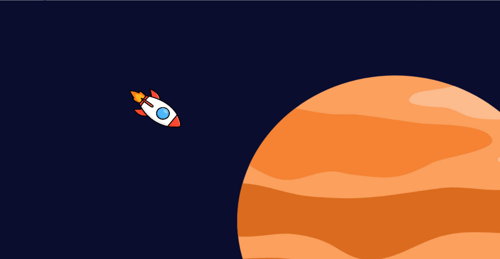<br> <sub>Fonte: Material produzido pelos autores (2026)</sub><br><br> </div>

Em seguida, o jogador deve escolher uma região adequada para a construção de uma base espacial. Para tomar essa decisão, é necessário compreender as características de cada área. São apresentadas cinco opções, sendo duas corretas (Planícies do Norte e Bacias de Impacto) e três inadequadas (Terras Altas do Sul, Regiões Cobertas por Poeira e Zonas Polares).

<div align="center"> Figura 57: Escolha do lugar<br><br> <br> <sub>Fonte: Material produzido pelos autores (2026)</sub><br><br> </div>

Após a escolha, o sistema apresenta um retorno imediato, indicando acerto ou erro, acompanhado de uma justificativa. Assim, o jogador compreende se a região selecionada é apropriada para habitação humana. Em seguida, ocorre uma nova animação mostrando o pouso da nave, que leva até um modal introdutório com a opção de iniciar a exploração.

<div align="center"> Figura 58: Pouso em Marte<br><br> <br> <sub>Fonte: Material produzido pelos autores (2026)</sub><br><br> </div>

Na etapa seguinte, o jogador explora o ambiente marciano em um cenário dinâmico, com itens distribuídos pelo espaço. Ao interagir com cada elemento, são exibidas descrições breves que explicam suas características. Esses itens são armazenados automaticamente em uma "prateleira" de coletáveis. Após reunir todos os recursos, a etapa de construção da base é liberada.

<div align="center"> Figura 59: Coleta de recursos<br><br> <br> <sub>Fonte: Material produzido pelos autores (2026)</sub><br><br> </div>

Na fase de criação da base espacial, os itens coletados são utilizados na formação de estruturas e funcionalidades essenciais para a sobrevivência humana. Com base nos enunciados, o jogador deve combinar corretamente dois elementos para atender ao objetivo proposto. Em caso de erro, o sistema apresenta um direcionamento que auxilia no raciocínio, permitindo novas tentativas. Ao concluir todas as combinações, o jogador é encaminhado para a próxima etapa.

<div align="center"> Figura 60: Criação da base espacial<br><br> <br> <sub>Fonte: Material produzido pelos autores (2026)</sub><br><br> </div>

Em seguida, é apresentada a última cena da fase de Marte, com um modal que parabeniza o jogador pela conclusão, ao mesmo tempo em que o prepara para o desafio final. Ao clicar no botão "Estou pronto", o jogador é direcionado para a fase final do jogo Astra.

<div align="center"> Figura 61: Finalização da Fase Marte<br><br> <br> <sub>Fonte: Material produzido pelos autores (2026)</sub><br><br> </div>

O desafio final consiste em responder perguntas relacionadas a todo o conteúdo aprendido ao longo do jogo. Com apenas duas vidas disponíveis, o jogador pode cometer apenas um erro antes de encerrar essa fase. Ao concluir essa etapa com sucesso, é exibido um modal parabenizando pela vitória.

<div align="center"> Figura 62: Finalização do jogo Astra <br><br> <br> <sub>Fonte: Material produzido pelos autores (2026)</sub><br><br> </div>

### Finalização do jogo ASTRA

O desenvolvimento das fases da Terra e de Marte evidencia a evolução do jogo Astra em aspectos visuais e técnicos. Na fase terrestre, melhorias como aumento de contraste e novos recursos, como o sistema de leitura, tornaram a experiência mais acessível e fluida. Já na fase de Marte, esses avanços foram ampliados com mecânicas interativas que estimulam a participação e a aplicação prática do conhecimento. Assim, o jogo se consolida como uma experiência imersiva, acessível e centrada no aprendizado do jogador.

Durante a implementação, surgiram desafios importantes, como a criação de uma estrutura responsiva consistente para diferentes tamanhos de tela e dispositivos. Também exigiu atenção a alteração da estrutura inicial do modal adaptado, com objetivo de incluir um overlay sem alterar o código já existente.

Como próximos passos, estão previstos a adição de áudios explicativos na fase de Marte e o aprimoramento da dinâmica da linha do tempo, com a implementação de seleção automática de campos, deixando ao jogador apenas a escolha da carta correspondente. Também será removido o sistema de exibição contínua de texto na apresentação das regiões de Marte, devido à identificação de poluição visual e alta carga cognitiva.

Além disso, será implementado um sistema de salvaguarda, com o objetivo de minimizar perdas de progresso, permitindo a atualização da tela sem comprometer a continuidade do jogo e garantindo a retomada do ponto já alcançado pelo jogador ao longo do Astra. 

Adicionalmente, a equipe, em conjunto com os professores, irá definir critérios para avaliação e classificação dos elementos do jogo, visando aprimorar a organização e a clareza dessas informações na documentação do projeto.

## 4.5. Revisão do MVP

*Descreva e ilustre aqui o desenvolvimento dos refinamentos e revisões da versão final do jogo, explicando brevemente o que foi entregue em termos de MVP. Utilize prints de tela para ilustrar.*

# <a name="c5"></a>5. Testes

## 5.1. Casos de Teste

Nesta seção, são apresentados os testes realizados até o presente momento, referentes ao desenvolvimento do jogo Astra. Essas verificações foram fundamentais para validar as funcionalidades implementadas, garantindo a continuidade do projeto e reduzindo a ocorrência de retrabalhos e incertezas futuras.
<br><br>
A Tabela 1 apresenta a pré-condição, que define o estado inicial ou cenário necessário para a execução do teste. A descrição detalha as ações ou o passo a passo a ser realizado pelo jogador. Além da pós-condição corresponder ao resultado esperado ou à resposta do sistema após a interação.
<div align="center">
 Tabela 1: Caso de Teste Astra<br><br>
</div>

| Tela | Pré-condição | Descrição do Teste | Pós-condição | Data | Responsável |
|------|--------------|-------------------|--------------|------|-------------|
| 1 | Jogador acessou a URL inicial do jogo. | Clicar no botão **"Vamos começar"**. | O jogo redireciona o jogador para a próxima tela **"Sistema Solar"**. | 26/02 | Julia Khristina |
| 2 | O jogador está na tela **"Sistema Solar"**. | Passar o mouse sobre cada um dos planetas. | O planeta focado aumenta de tamanho proporcionalmente. | 26/02 | Julia Khristina |
| 2 | O jogador está na tela **"Sistema Solar"**. | Clicar no planeta **Terra**. | O sistema redireciona para a tela **"Primeiro Tutorial"**. | 26/02 | Julia Khristina |
| 3 | O jogador está na tela **"Primeiro Tutorial"**. | Clicar no botão **"Vamos começar"**. | O jogo redireciona o jogador para a próxima tela **"Tutorial"**. | 26/02 | Julia Khristina |
| 4 | O jogador está na tela **"Tutorial"**. | Mover o cursor do mouse para diferentes direções na tela. | A nave segue a posição do cursor, alterando seu deslocamento conforme a direção desejada. | 26/02 | Julia Khristina |
| 4 | O jogador está na tela **"Tutorial"** com a nave em movimento. | Direcionar a nave contra um meteoro. | O jogo pausa e exibe o modal de aviso **"Cuidado!"**. | 26/02 | Julia Khristina |
| 4 | Modal de aviso aberto. | Clicar no botão **"Entendi"**. | O modal será fechado. | 26/02 | Julia Khristina |
| 4 | O jogador está na tela **"Tutorial"**. | Após 30 segundos de jogo. | O jogo redireciona o jogador para a próxima tela **"chegada_terra"**. | 26/02 | Julia Khristina |
| 5 | O jogador está na tela **"chegada_terra"**. | Espera-se a nave realizar a manobra de rotação e concluir a aterrissagem. | O jogo redireciona o jogador para a próxima tela **"Terra_Marte"**. | 26/02 | Julia Khristina |
| 6 | O jogador está na tela **"Terra_Marte"**. | Mover o cursor do mouse para diferentes direções. | A nave segue a posição do cursor conforme a direção desejada. | 26/02 | Julia Khristina |
| 6 | O jogador está na tela **"Terra_Marte"** com a nave em movimento. | Direcionar a nave contra um meteoro. | O jogo pausa e exibe o modal de pergunta. | 26/02 | Julia Khristina |
| 6 | Modal de pergunta aberto. | Clicar na alternativa. | Aparecerá o botão de envio. | 26/02 | Julia Khristina |
| 6 | Modal de pergunta aberto. | Clicar no botão de envio. | Exibição de feedback visual (verde para corretas, vermelho para incorretas). | 26/02 | Julia Khristina |
| 6 | Modal de pergunta aberto. | Feedback da alternativa visível ao jogador. | O botão **"Enviar"** foi desativado/removido da tela. | 26/02 | Julia Khristina |
| 6 | Modal de pergunta aberto. | Feedback da alternativa visível ao jogador. | Após 2 segundos, o modal será fechado, voltando a chuva de meteoros. | 26/02 | Julia Khristina |
| 6 | O jogador está na tela **"Terra_Marte"**. | Todas as alternativas já foram respondidas. | O jogo redireciona o jogador para a próxima tela. | 26/02 | Julia Khristina |
| 6 | O jogador está na tela **"Terra_Marte"**. | O jogador errou uma questão | O jogador perderá uma vida | 27/03 | Eduardo Maciel |
| 6 | O jogador está na tela **"Terra_Marte"**. | O jogador ficou sem vidas | A cena reiniciará junto com as vidas do jogador que serão restauradas| 27/03 | Eduardo Maciel |
| 7 | O jogador está na tela de leitura, que exibe as primeiras palavras do conteúdo do slide. | Mover o mouse em sentido para baixo. | O texto desce, revelando o conteúdo seguinte do slide. | 27/03 | Eduardo Maciel |
| 7 | O jogador está na tela de leitura, que exibe as primeiras palavras do conteúdo do slide. | Mover o mouse em sentido para cima. | O texto sobe, retornando ao conteúdo anterior do slide. | 27/03 | Eduardo Maciel |
| 8 | O jogador está no modal de slides com explicações sobre os terrenos de Marte. | Clicar em uma das setas repetidamente, avançando o conteúdo do modal até o último slide. | O jogador é redirecionado para a tela de confirmação de escolha. | 27/03 | Eduardo Maciel |
| 9 | O jogador está na tela de confirmação de escolha em relação à região mais propensa à habitação humana. | Clicar em uma das alternativas disponíveis e em seguida no botão **"Enviar"**. | A resposta é registrada e o jogador é redirecionado para a próxima tela. | 27/03 | Eduardo Maciel |
| 10 | O jogador está no cenário de Marte com a lente visível na tela. | Mover o mouse para os lados do círculo da lente. | A câmera se desloca acompanhando o movimento do mouse e objetos escondidos são revelados no cenário. | 27/03 | Eduardo Maciel |
| 10 | O jogador está no cenário de Marte com objetos escondidos já revelados pela lente. | Clicar em um dos objetos revelados. | O jogo exibe as informações sobre o objeto e o adiciona ao inventário do jogador. | 27/03 | Eduardo Maciel |
| 11 | O jogador concluiu todas as interações do cenário de Marte 1. | O sistema carrega automaticamente o cenário de Marte 2. | O cenário de Marte 2 é iniciado e exibido corretamente para o jogador. | 27/03 | Eduardo Maciel |
| 12 | O jogador está na tela de combinação de elementos, com os itens coletados disponíveis na prateleira. | Clicar nos elementos da prateleira para adicionar nos círculos disponíveis na tela. | Cada elemento é posicionado corretamente no círculo de destino. | 27/03 | Eduardo Maciel |
| 12 | Todos os círculos da tela de combinação estão ocupados, cada um com um único elemento. | Clicar no botão **"Enviar"**. | O jogador é redirecionado para a tela de feedback com o resultado da combinação. | 27/03 | Eduardo Maciel |
| 13 | O jogador está na tela de Marte_BuracoNegro | O jogador sobreviveu a última chuva de meteoros  | O jogador é redirecionado para a tela de encerramento em que será parabenizado. | 27/03 | Eduardo Maciel |

<div align="center">
 <sub>Fonte: Material produzido pelos autores (2026)</sub><br><br>
</div>

## 5.2. Testes de jogabilidade (playtests)

### 5.2.1 Registros de testes

*Descreva nesta seção as sessões de teste/entrevista com diferentes jogadores. Registre cada teste conforme o template a seguir.*

Nome | João Jonas (use nomes fictícios)
--- | ---
Já possuía experiência prévia com games? | sim, é um jogador casual
Conseguiu iniciar o jogo? | sim
Entendeu as regras e mecânicas do jogo? | entendeu as regras, mas sobre as mecânicas, apenas as essenciais, não explorou os comandos complexos
Conseguiu progredir no jogo? | sim, sem dificuldades  
Apresentou dificuldades? | Não, conseguiu jogar com facilidade e afirmou ser fácil
Que nota deu ao jogo? | 9.0
O que gostou no jogo? | Gostou  de como o jogo vai ficando mais difícil ao longo do tempo sem deixar de ser divertido
O que poderia melhorar no jogo? | A responsividade do personagem aos controles, disse que havia um pouco de atraso desde o momento do comando até a resposta do personagem

### 5.2.2 Melhorias

*Descreva nesta seção um plano de melhorias sobre o jogo, com base nos resultados dos testes de jogabilidade*

# <a name="c6"></a>6. Conclusões e trabalhos futuros

*Escreva de que formas a solução do jogo atingiu os objetivos descritos na seção 1 deste documento. Indique pontos fortes e pontos a melhorar de maneira geral.*

*Relacione os pontos de melhorias evidenciados nos testes com plano de ações para serem implementadas no jogo. O grupo não precisa implementá-las, pode deixar registrado aqui o plano para futuros desenvolvimentos.*

*Relacione também quaisquer ideias que o grupo tenha para melhorias futuras*

# <a name="c7"></a>7. Referências:
#### 1.1.1.1: 5 Forças de Porter:
 - **https://www.santander.pt/salto/5-forcas-de-porter**.


#### 1.1.4: Propostas de Valor:
 - **https://www.strategyzer.com/library/the-value-proposition-canvas**.


#### 1.1.5: Descrição da Solução Desenvolvida: 
 - **(1): https://reatechbrasil.com.br/16/equipamentos-avancados-oferecem-seguranca-e-conforto-para-pessoas-com-deficiencia/**;
 - **(2): https://g1.globo.com/educacao/blog/andrea-ramal/post/nao-e-o-aluno-e-sim-escola-que-e-deficiente.html**;
 - **(3): https://www.oecd.org/en/publications/pisa-2022-results-volume-i-and-ii-country-notes_ed6fbcc5-en/brazil_61690648-en.html**;
 - **(4): https://www.edgeeye.com.br/**.


#### 1.1.6: Matriz de Riscos:
 - **https://www.pmi.org/learning/library/risk-management-9096**.


#### 1.1.7: Objetivos, Metas e Indicadores:
 - **https://sebrae.com.br/Sebrae/Portal%20Sebrae/UFs/PE/Anexos/Guia%20completo%20para%20definir%20metas%20SMART%20na%20empresa.pdf**.


#### 3.2.3: Diversidade e Representatividade dos Personagens:
 - **(1): https://g1.globo.com/saude/noticia/2025/05/15/pesquisa-analisa-dna-do-brasileiro-e-descobre-que-pais-tem-a-maior-diversidade-genetica-do-mundo-veja-na-sua-regiao.ghtml**;
 - **(2): https://sinesp.org.br/images/2024/novembro/Brasil_e_regi%C3%B5es_2024_-_Popula%C3%A7%C3%A3o_negra1.pdf**;
 - **(3): https://www.nintendo.com/pt-br/store/products/drag-x-drive-switch-2/?srsltid=AfmBOooL8isAP-PVDFtfKkuz_HFlLPG1T3pGeatmRZTv5f0pUTODgEJ9**;
 - **(4):https://www.adorocinema.com/filmes/filme-219070/**.

#### 3.3.5: Trilha sonora:
**https://elevenlabs.io/pt/conversational-ai?utm_source=google&utm_medium=cpc&utm_campaign=worldwide_nonbrandsearch_conversationalai_portuguese&utm_id=23289887225&utm_term=ia%20que%20fala&utm_content=conversational_ai_-_talking_ai&gad_source=1&gad_campaignid=23289887225&gbraid=0AAAAA_PU6FZDbOOPjKzBB3ii4OqfgNC0H&gclid=Cj0KCQjw9-PNBhDfARIsABHN6-0bJbri2ghB9GIm7LV6pKrCA61f90l7R6gBj8pLl_jLGFmuroKm8bkaAs_MEALw_wcB**.

SINESP. Brasil e regiões 2024 – População negra. Brasília: SINESP, 2024.
Disponível em: https://sinesp.org.br/images/2024/novembro/Brasil_e_regi%C3%B5es_2024_-_Popula%C3%A7%C3%A3o_negra1.pdf.
Acesso em: 27 fev. 2026.

DEUTSCHE WELLE (DW). Brasil tem a maior diversidade genética do mundo, diz estudo.
[S.l.]: DW Brasil, 2024. Disponível em:
https://www.dw.com/pt-br/brasil-tem-a-maior-diversidade-gen%C3%A9tica-do-mundo-diz-estudo/a-72561021.
Acesso em: 27 fev. 2026.

NINTENDO. Drag x Drive – Nintendo Switch 2. [S.l.]: Nintendo, [2025].
Disponível em: https://www.nintendo.com/pt-br/store/products/drag-x-drive-switch-2/.
Acesso em: 27 fev. 2026.


LUCK, Heloisa. Liderança em gestão escolar. 4. ed. Petrópolis: Vozes, 2010. <br>
SOBRENOME, Nome. Título do livro: subtítulo do livro. Edição. Cidade de publicação: Nome da editora, Ano de publicação. <br>

INTELI. Adalove. Disponível em: https://adalove.inteli.edu.br/feed. Acesso em: 1 out. 2023 <br>
SOBRENOME, Nome. Título do site. Disponível em: link do site. Acesso em: Dia Mês Ano

HALLIDAY, David; RESNICK, Robert; WALKER, Jearl. Fundamentos de Física - Mecânica - Volume 1. 12. ed. Rio de Janeiro: LTC, 2023. E-book. p.13. ISBN 9788521638551. Disponível em: https://integrada.minhabiblioteca.com.br/reader/books/9788521638551/. Acesso em: 19 mar. 2026.

PUCPR. MVP: o que é, como aplicar e por que é importante. PUC PR Digital, [s.d.]. Disponível em: https://posdigital.pucpr.br/blog/mvp. Acesso em: 25 mar. 2026.


# <a name="c8"></a>Anexos

*Inclua aqui quaisquer complementos para seu projeto, como diagramas, imagens, tabelas etc. Organize em sub-tópicos utilizando headings menores (use ## ou ### para isso)*